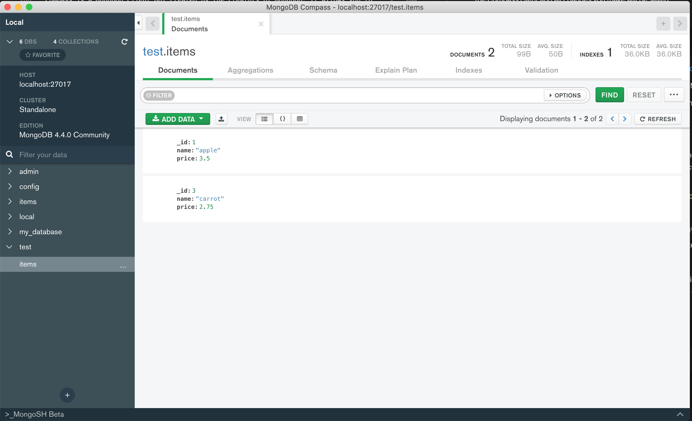

# Unit 2-B Lecture

In this lecture, we will cover:
* MongoDB
* Mongo Shell
* Connecting Node.js to MongoDB using Mongoose
* Defining database schemas with Mongoose
* Writing data to MongoDB
* Reading data from MongoDB

It is recommended to follow along by making a project directory for this lecture and running the code samples:

```
mkdir lecture2B
cd lecture2B
npm init
```

## MongoDB

MongoDB is a NoSQL Database. Compared to traditional relational databases that use tables and rows, MongoDB uses *documents* and *collections*.

### MongoDB Documents

MongoDB stores data as JSON *documents*. A document represents one record, making it analogous to a row in a relational database.

The document data model maps naturally to objects in application code, making it simple for developers to learn and use.

The fields in a JSON document can vary from document to document. Compare that to a traditional relational database table, where adding a field means adding a column to the database table itself and, therefore, to every record in the database.

Documents can be nested to express hierarchical relationships and to store structures such as arrays.

The document model provides flexibility to work with complex, fast-changing, messy data from numerous sources. It enables developers to quickly deliver new application functionality.

For faster access internally and to support more data types, MongoDB converts documents into a format called Binary JSON or BSON. But from a developer perspective, MongoDB is a JSON database.


### MongoDB Collections

In MongoDB, a collection is a group of documents.

If you are familiar with relational databases, you can think of a collection as a table. But collections in MongoDB are far more flexible. Collections do not enforce a schema, and documents in the same collection can have different fields.

Each collection is associated with one MongoDB database. 


### Installing MongoDB


It is recommended to download MongoDB with homebrew.

To install homebrew:

```
 $ /bin/bash -c "$(curl -fsSL https://raw.githubusercontent.com/Homebrew/install/master/install.sh)" 
```

Next, install mongodb with homebrew.

First, run the following:
```
$ brew tap mongodb/brew
```

Then run:

```
$ brew install mongodb-community@4.4
```


The homebrew installation will create the following folders and files on your computer:

* the configuration file (/usr/local/etc/mongod.conf)
* the log directory path (/usr/local/var/log/mongodb)
* the data directory path (/usr/local/var/mongodb) 

Before you can interact with mongoDB, you need to start the mongoDB service with:

```
brew services start mongodb-community@4.4
```

You can stop it later with:

```
brew services stop mongodb-community@4.4
```

Now that you've started the mongoDB service, you can access the mongo shell with:

```
mongo
```

## Mongo Shell

Try running the Mongo Shell with:

```
mongo
```

If done correctly, the command line prompt should switch to a >.

To see a list of useful commands, run :

```
help

> help
	db.help()                    help on db methods
	db.mycoll.help()             help on collection methods
	sh.help()                    sharding helpers
	rs.help()                    replica set helpers
	help admin                   administrative help
	help connect                 connecting to a db help
	help keys                    key shortcuts
	help misc                    misc things to know
	help mr                      mapreduce

	show dbs                     show database names
	show collections             show collections in current database
	show users                   show users in current database
	show profile                 show most recent system.profile entries with time >= 1ms
	show logs                    show the accessible logger names
	show log [name]              prints out the last segment of log in memory, 'global' is default
	use <db_name>                set current database
	db.mycoll.find()             list objects in collection mycoll
	db.mycoll.find( { a : 1 } )  list objects in mycoll where a == 1
	it                           result of the last line evaluated; use to further iterate
	DBQuery.shellBatchSize = x   set default number of items to display on shell
	exit                         quit the mongo shell
```

Lets start by seeing what available databases there are already:
> show collections
> db.items.insert({name:"apple",price:3.50})
WriteResult({ "nInserted" : 1 })

```
> show dbs
admin   0.000GB
config  0.000GB
local   0.000GB
```

Let's create a new database named `test` by running:

```
> use test
switched database to test
```

This will switch our active database to `test`. If `test` doesn't exist, MongoDB will create a new database for us.


To verify that we are using our new `test` database, run:

```
> db
test
```


Now let's see what collections exist within `test`:

```
> show collections
```

No collections showed up, so lets create a collection and insert a document into it:

```
> db.items.insert({_id:1, name:"apple",price:3.50})
WriteResult({ "nInserted" : 1 })
```

Now let's check our collections list again:

```
> show collections
items
```

Next, let's read all the documents that are currently in the `items` collection:

```
> db.items.find({})
{ "_id" : 1, "name" : "apple", "price" : 3.5 }
```

Next, let's try inserting multiple collections at the same time:

```
> db.items.insert([{_id:2, name:"banana",price:2.00},{_id:3, name:"carrot",price:2.75}])
BulkWriteResult({
	"writeErrors" : [ ],
	"writeConcernErrors" : [ ],
	"nInserted" : 2,
	"nUpserted" : 0,
	"nMatched" : 0,
	"nModified" : 0,
	"nRemoved" : 0,
	"upserted" : [ ]
})
```

Let's read the all the documents again within `item`:
```
> db.items.find({})
{ "_id" : 1, "name" : "apple", "price" : 3.5 }
{ "_id" : 2, "name" : "banana", "price" : 2 }
{ "_id" : 3, "name" : "carrot", "price" : 2.75 }
```

We can query for items with specific attributes too.

Querying for items who's price is less than 3:
```
> db.items.find({ price: { $lt: 3}})
{ "_id" : 2, "name" : "banana", "price" : 2 }
{ "_id" : 3, "name" : "carrot", "price" : 2.75 }
```

Querying for items who's name is "banana":
```
> db.items.find({ "name": "banana"})
{ "_id" : 2, "name" : "banana", "price" : 2 }
```


Now, let's try updating one of our documents, we can do so by specifing the object _id:

```
> db.items.update(
...    { _id: 2},
...    {
...      name:"yellow banana",
...      price:2.99
...    }
... )
WriteResult({ "nMatched" : 1, "nUpserted" : 0, "nModified" : 1 })
```

Let's check see if it was updated:

```
> db.items.findOne({_id:2})
{ "_id" : 2, "name" : "yellow banana", "price" : 2.99 }
```

**Best Practice:** The findOne function will return the first document that matches a query whereas find() will send a list of all documents that match the query. findOne is useful if you only want one document and don't want to access the 0th index of a result array when using find().

We can also remove collections:

```
> db.items.remove({ "_id": 2})
WriteResult({ "nRemoved" : 1 })
```

Similar to find(), the remove() method takes in an object that specifies which documents to remove based on their attributes.

**Warning:** If you leave the filter object as a blank {}, remove() will remove everything from your collection.


You can read more about Mongo Shell methods at their official website:
https://docs.mongodb.com/manual/reference/method/


## Knowledge Check 1

In MongoDB, which of the following is analogous to a record in a relational database

```
A. MongoRow
B. Collection
C. Document
D. Database
```

## Mongo Compass

Compass is a MongoDB Client GUI created by the creators of MongoDB. It allows you to view your MongoDB in a graphical interface and view all of your collections and documents. You can also alter MongoDB documents within the Compass client, and all changes you make will be saved.



You can install it with homebrew:

```
$ brew cask install mongodb-compass 
```

Or download it from the official site:
https://docs.mongodb.com/compass/master/install/#


You should now have a new application on your computer named MongoDB Compass.

If you receive a security error when starting Compass indicating that the developer could not be identified or verified, perform the following actions to allow Compass to run:

* Open System Preferences.
* Select the Security and Privacy pane.
* Under the General tab, click the button to the right of the message about Compass, labeled either Open Anyway or Allow Anyway depending on your version of macOS.
* If necessary, re-open Compass.

To use Compass, simply pass in a connection URI such as `mongodb://localhost:27017/items'` and begin viewing and editing all of your collections and documents.

## Connecting MongoDB to Node.js with Mongoose

There are several third-party modules that allow us to read and write to a mongoDB database with Node.js code.

Although MongoDB comes with its own module for connecting to Node.js, we will be using the Mongoose module to do so instead because it is easier to use and has additional features to model schemas.

Mongoose is also known as an ODM library, or Object Data Modeling library. This is useful because Mongoose allows us to define database schemas to help keep our mongoDB documents more consistent.

To add Mongoose as a dependency run:

```
$ npm install mongoose
```

To import Mongoose into your code, use require():

```js
const mongoose = require('mongoose');

```

After that, you can initiate a database connection by using:
```js
mongoose.connect('mongodb://localhost:27017/my_database');

```


### Basic MongoDB Read and Write

Here is some basic code to connect to a mongoDB instance and insert a new document:

```js

const mongoose = require('mongoose'); //1. import mongoose module

mongoose.connect('mongodb://localhost:27017/items'); //2. connect to mongoDB instance, with database specified

const { Schema } = mongoose; // 3. load Schema constructor function from mongoose module

const itemSchema = new Schema({
  //4. define schema for an Item document
  name: String,
  price: Number,
});

const Item = mongoose.model('Item', itemSchema); //5. Create an Item constructor using the Item Schema

const item = new Item({ name: 'Watermelon2', price: 5.55 }); //6. create a new Item instance using the Item constructor

item.save((error) => {
  //7. insert item we just created into mongoDB, update if the _id already exists
  if (error) {
    return console.log(`Error has occurred: ${error}`);
  }
  console.log('Document is successfully saved.');

  Item.find({}, function (error, documents) {
    //8. query for all Item documents in the Item collection
    console.log(documents); //9. the item we just saved should be among the results
  });
});
const mongoose = require('mongoose'); //1. import mongoose module

mongoose.connect('mongodb://localhost:27017/items'); //2. connect to mongoDB instance, with database specified

const { Schema } = mongoose; // 3. load Schema constructor function from mongoose module

const itemSchema = new Schema({
  //4. define schema for an Item document
  name: String,
  price: Number,
});

const Item = mongoose.model('Item', itemSchema); //5. Create an Item constructor using the Item Schema

const item = new Item({ name: 'Watermelon2', price: 5.55 }); //6. create a new Item instance using the Item constructor

item.save((error) => {
  //7. insert item we just created into mongoDB, update if the _id already exists
  if (error) {
    return console.log(`Error has occurred: ${error}`);
  }
  console.log('Document is successfully saved.');

  Item.find({}, function (error, documents) {
    //8. query for all Item documents in the Item collection
    console.log(documents); //9. the item we just saved should be among the results
  });
});


```

Here's whats going on in the above code:
1. First, we imported mongoose using require()
2. Next, we connected to our local mongoDB instance and specified that we want to connect to the items database
3. Next, we loaded the Schema constructor function from the mongoose module
4. Next, we defined a schema for an item that has a name as a string and a price as a number. We will cover Schemas more later on.
5. Next, we created an Item constructor from the Item schema definition. 
6. Next, we created a new Item instance using the Item constructor we created. We can modify its values just like any other JavaScript object and also save it to MongoDB using the .save() function.
7. Next, we inserted a document into MongoDB with .save(). save() will update the existing document if the _id property already exists.
8. In the callback of .save() we now to a query on all Item documents with Item.find() 
9. The item we inserted should show up in the results

**Best Practice**: There are many mongoose methods to update or insert documents, such as update() and insert(); however, it is a best practice to use `save()` instead when doing any inserting or updating because it has additional validation middleware that the other mongoose functions do not have. If you save() a document that doesn't exist, it will insert it. If you try to save() to insert a new document whose _id already exists, it won't insert it. If you query an existing document with find() or findOne() and then modify it and save() it, it will update the document.


## Knowledge Check 2

In Mongoose, what is the preferred way to insert or update an instance of a Schema item?

```
A. .insert()
B. .update()
C. .save()
D. .store()
```


## MongoDB Schemas

Schemas define what object structures can be saved as documents in MongoDB. SchemaTypes are used to bind properties in your document to certain value types. Once defined, schemas can be used similar to Class constructors in Java.

The following SchemaTypes are permitted in mongoose:
* String
* Number
* Date
* Buffer
* Boolean
* mongoose.Mixed
* mongoose.ObjectId
* Array
* mongoose.Decimal128
* Map

In general, you create a new Schema by using the Schema constructor from the mongoose module and then provide key values pairs of the document attribute names and their SchemaTypes:

```js
const { Schema } = mongoose;

const schema = new Schema({
  name: String,
  binary: Buffer,
  living: Boolean,
  updated: { type: Date, default: Date.now },
  age: { type: Number, min: 18, max: 65 },
  mixed: Schema.Types.Mixed,
  _someId: Schema.Types.ObjectId,
  decimal: Schema.Types.Decimal128,
  array: [],
  ofString: [String],
  ofNumber: [Number],
  ofDates: [Date],
  ofBuffer: [Buffer],
  ofBoolean: [Boolean],
  ofMixed: [Schema.Types.Mixed],
  ofObjectId: [Schema.Types.ObjectId],
  ofArrays: [[]],
  ofArrayOfNumbers: [[Number]],
  nested: {
    stuff: { type: String, lowercase: true, trim: true },
  },
  map: Map,
  mapOfString: {
    type: Map,
    of: String,
  },
});

```


The SchemaTypes with `mongoose.` in front of them must be referenced from the `mongoose` module object. All other SchemaTypes can be referenced as they are shown above or as strings(e.g. "Number")

With Array SchemaTypes, you can also define what type of SchemaTypes are allowed in the array such as :

```js
const ToySchema = new Schema({ name: String });
const ToyListSchema = new Schema({
  toys: [ToySchema],
  buffers: [Buffer],
  strings: [String],
  numbers: [Number],
  other: [],
  // ... etc
});

```

If you leave the array empty or use Array or 'Array', the SchemaType will be treated as a Mixed SchemaType.

### Document constructors

Once a schema is defined, it can be turned into a `document constructor` using the Mongoose.model() function:

```js
const { Schema } = mongoose;

const itemSchema = new Schema({
  name: String,
  price: Number,
});

const Item = mongoose.model('Item', itemSchema); //mongoose.model turns schema definitions into document constructors and also connects documents created with those document constructors to a specific database collection

//Item will be a part of the Items collection. In general, the schema model name is the singular of the collection name
Item.find({}).then((doc) => console.log(doc)); //search for all documents with the Item schema definition

const item = new Item({
  name: 'squash',
  price: 5.25,
});

item.save(); //save the document instance to the Items collection

```

`Document constructors` come with additional methods to query for or modify documents of the same schema definition, such as `Item.find()` and `Item.delete()`.

**Additional Context:** The string passed to `mongoose.model()` will associate the schema model with a collection that is the plural of the string provided according to English grammar laws. (e.g., Item will be apart of the Items collection, Mouse will be apart of the Mice collection...)

Objects created with `document constructors` become `document instances` and come with additional methods to save them to the database such as `item.save()`.


### _id

The _id property will be automatically added to your Schema with a SchemaType of ObjectId if you don't add it.

**Best Practice:** If you provide an _id, make sure that it is something that can uniquely identify a document.

### Schema Defaults and Ranges

You can provide default values for your document attributes in your schema declaration:

```js
const studentSchema = new Schema({
  name: { type: String, default: 'N/A' },
  date: { type: Date, default: Date.now },
});

```

You can also provide acceptable ranges for your schema values:

```js
const studentSchema = new Schema({
  age: { type: Number, min: 18, max: 65 },
});

```


### Schema Validation

When you try to .save() a value with Mongoose, the SchemaTypes will try to cast the values you provide to the appropriate SchemaType. If they are unable to do, an error will occur because the values you provided were incompatible to the SchemaType:

For example, if you use a String when the schema is a Number:
```js
const item = new Item({
  _id: 'not a number',
  name: 'Watermelon2',
  price: 'not an number',
});

item.save((error) => {
  if (error) {
    return console.log(`Error has occurred: ${error}`);
  }
  console.log('Document is successfully saved.');
});

```
You'll get an error similar to this:
```
Error has occurred: ValidationError: _id: Cast to Number failed for value "bob" at path "_id", price: Cast to Number failed for value "joe" at path "price"
```


## Knowledge Check 3

Which of the following are benefits of Mongoose Schemas? Select all that apply.
```
A. They allow you to easily find documents in MongoDB with the same schema
B. They make sure objects in Node.js match the shape of a MongoDB collection 
C. They allow you to easily insert or update schema objects 
D. They allow you to establish a MongoDB connection to your Node.js server 
```


## Basic Server with MongoDB

Here is some basic code to connect to MongoDB with mongoose so that we can read and write information from the database and send it out in an API:

```js
//index.js
const express = require('express');
const mongoose = require('mongoose');
const app = express();
const port = 3000;

mongoose
  .connect('mongodb://localhost:27017/my_database', { useNewUrlParser: true })
  .then(() => {
    const { Schema } = mongoose;

    const itemSchema = new Schema({
      name: String,
      price: Number,
    });

    const Item = mongoose.model('Item', itemSchema); //Item will be a part of the Items collection. In general, the Model name is the singular of the collection name

    app.get('/items', async (req, res) => {
      const items = await Item.find();
      res.json(items);
    });

    app.post('/item', async (req, res) => {
      let item = new Item({ name: req.body.name, price: req.body.price });
      const result = await item.save();
      res.json(result);
    });

    app.listen(port, () => {
      console.log(`Example app listening at http://localhost:${port}`);
    });
  });


```

Try using the Advanced REST Client and make a GET request to http://localhost:3000/items to get whatever is stored in the Items collection in our local MongoDB instance.

Next, try making a POST request to http:localhost:3000/item and add in a body with the same schema as the one we defined

Then make another GET request to http://localhost:3000/items to verify that the item document was saved to the database.

**Best Practice:** We are using `async` and `await` with our Mongoose methods because it makes the asynchronous database requests easier to read.

### Modularizing schemas

In this code example, we had all of our Schemas in the same file as our endpoints, but you'll probably want to make separate files for Schemas and import them in the future. 


We could have our Item schema stored in models/item.js:
```js
//models/item.js
const mongoose = require('mongoose');

const { Schema } = mongoose;

const itemSchema = new Schema({
  name: String,
  price: Number,
});

const Item = mongoose.model('Item', itemSchema);

module.exports = Item;

```


And then import it into our router logic:

```js
//index.js
const express = require('express');
const mongoose = require('mongoose');
const Item = require('./models/item.js');
const app = express();
const port = 3000;

mongoose
  .connect('mongodb://localhost:27017/my_database', { useNewUrlParser: true })
  .then(() => {
    app.get('/items', async (req, res) => {
      const items = await Item.find(); //Item was imported from our schema file
      res.json(items);
    });

    app.post('/item', async (req, res) => {
      let item = new Item({ name: req.body.name, price: req.body.price }); //Item was imported from our schema file
      const result = await item.save();
      res.json(result);
    });

    app.listen(port, () => {
      console.log(`Example app listening at http://localhost:${port}`);
    });
  });


```


# Lecture 2-B Lab

## Lab Overview

Your engineering team at ABC Solutions Company has just adopted MongoDB as their primary database for storing employee data. You are in charge of migrating all of the endpoints to read and write to MongoDB instead of the JSON file.

In addition, you must also use Mongoose schemas to model your employee data. Your code base is starting to get complex, so it is recommended to have Mongoose schemas in their own folder calls `models` and import them as needed.

Lastly, your MongoDB database won't have all of the employee data so you will need to import in the employee data from the JSON file.

## Lab Starter Code

Your lab for Unit 2B will start off where your lab for unit 2A ended. 

You can clone your starter code here:
[LINK]

Make sure to install all of the dependencies with:
```
$ npm install
```

You can run your server with:

```
$ node index.js
```

### Seeding your MongoDB Database with JSON Data

To import the all employees from the employee data JSON file into your MongoDB database as documents, take the following steps:

1. Connect to your MongoDB instance with Compass
2. Select the database you want to use
3. Select the `employees` collection, create a new collection named `employees` if it doesn't exist yet
4. Click the Add Data dropdown, click Import File, browse to `employee_data_master_copy.json`, make sure to select JSON as the file type, then click Import.
5. Verify that your data was added successfully (there should be 943 documents)


Here's the official documentation on importing data into MongoDB.
https://docs.mongodb.com/compass/master/import-export


If you need a fresh `employee_data.json` file at any point you can copy over the contents from `employee_data_master_copy.json` which should also be in the public folder of your lab.

## Lab Solution

You can find the lab solution here:
[LINK]

# Knowledge Check Answers


## Knowledge Check 1

In MongoDB, which of the following is analogous to a record in a relational database

```
A. MongoRow
B. Collection
C. Document
D. Database
```

Answer is B.

## Knowledge Check 2

In Mongoose, what is the preferred way to insert or update an instance of a Schema item?

```
A. .insert()
B. .update()
C. .save()
D. .store()
```

Answer is C.

## Knowledge Check  3
Which of the following are benefits of Mongoose Schemas? Select all that apply.

```
A. They allow you to easily find documents in MongoDB with the same schema
B. They make sure objects in Node.js match the shape of a MongoDB collection 
C. They allow you to easily insert or update schema objects 
D. They allow you to establish a MongoDB connection to your Node.js server 
```

Answer is A, B and C.


