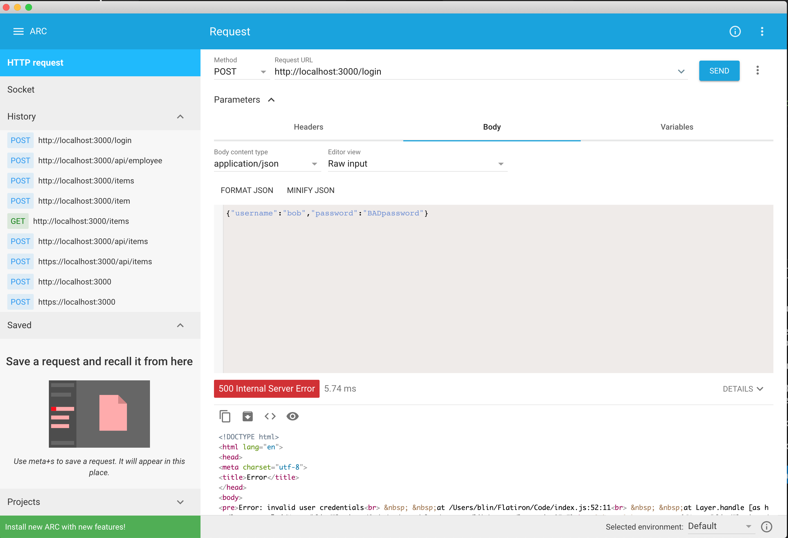
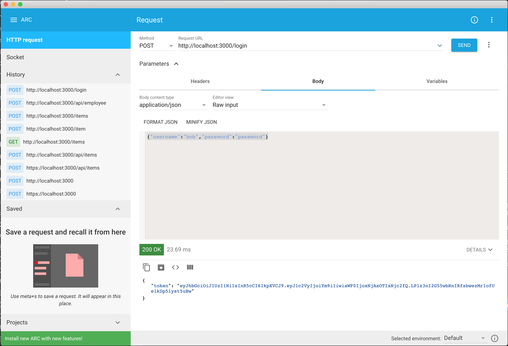
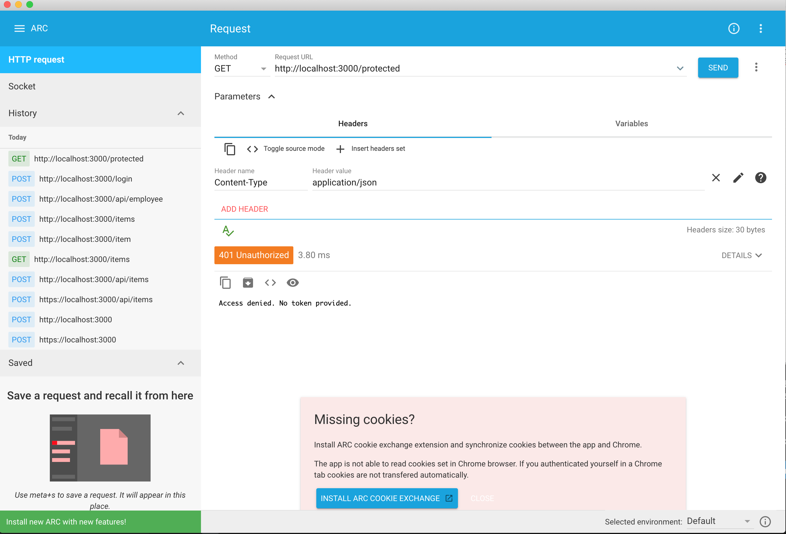
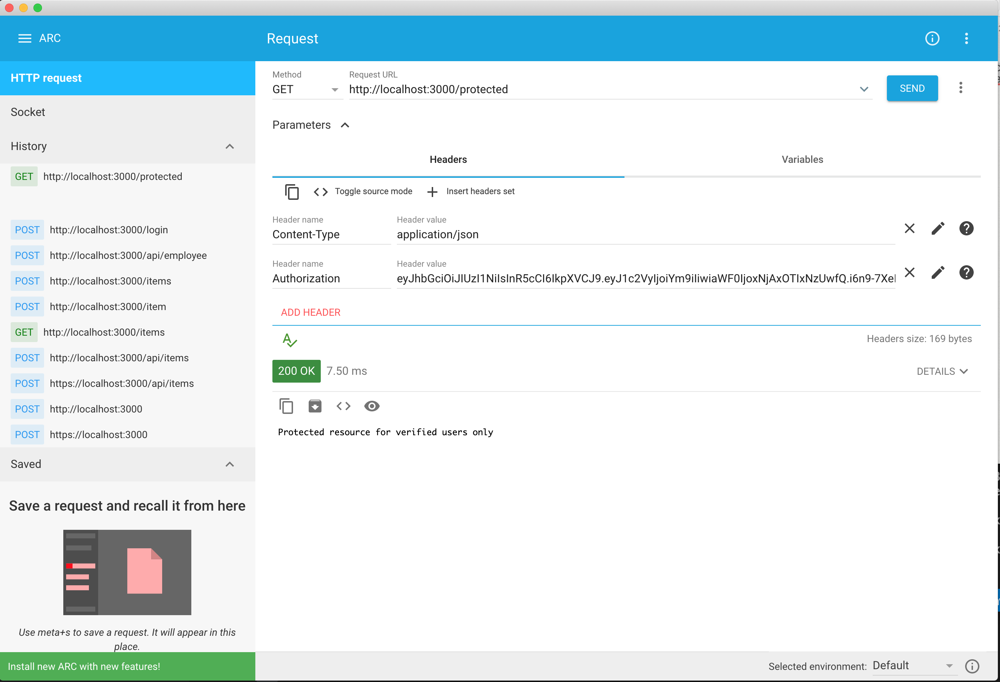
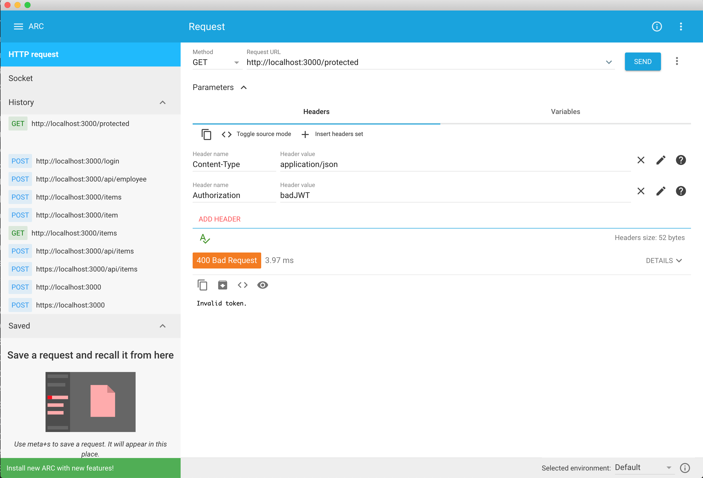
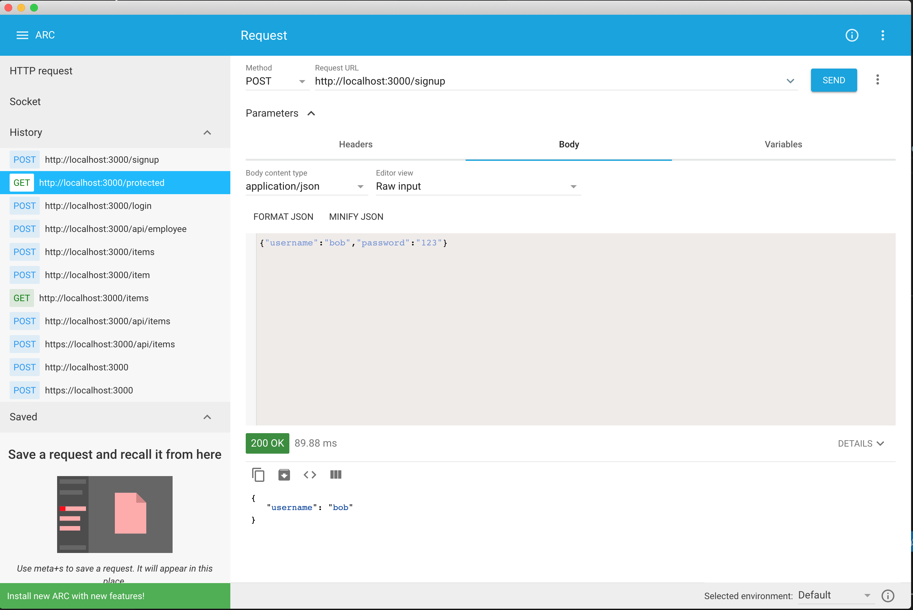
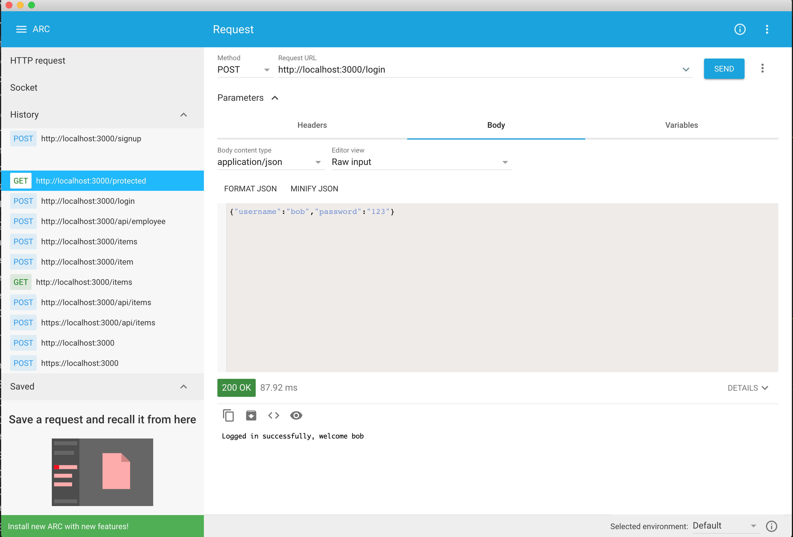

# Unit 2-C

This lecture will cover the following topics:

* Authentication
* Authorization
* JSON Web Tokens
* Bcrypt


It is recommended to follow along by making a project directory for this lecture and running the code samples:

```
mkdir lecture2C
cd lecture2C
npm init
```

## Authentication and Authorization

Authentication and Authorization sound similar but they relate to different parts of identify and access management.

*Authentication* confirms that users are who they say they are. 

*Authorization* gives those users permission to access a resource.


### Authentication

Authentication is the act of validating that users are whom they claim to be. This is the first step in any security process. 

Authentication can be verified through:

* Passwords. Usernames and passwords are the most common authentication factors. If a user enters the correct data, the system assumes the identity is valid and grants access.
* One-time pins. Grant access for only one session or transaction.
* Authentication apps. Generate security codes via an outside party that grants access 
* Biometrics. A user presents a fingerprint or eye scan to gain access to the system.
* Third party sign in - Uses a third party to verify identity such as Log in with Facebook or Google
* Multi-factor authentication - using more than one form of authentication to improve security

### Authorization


Authorization is the process of granting useres with permissions to access resources. 

Some examples of authorization include:

* Getting access to modify your profile settings on Facebook
* Getting access to a premium section of a website for premium members
* Getting access to read or write to certain files on a shared network
* Getting access to an admin panel of a website for admin users
* Getting access to use certain API endpoints


Authentication usually happens before Authorization, because it is difficult to determine what permissions to grant if you don't know who the user actually is.


## Knowledge Check 1

When a security system determines that you are allowed to go a restricted room, it is an example of: 

```
A. Authentication
B. Authorization
C. Both
D. Neither
```


## JSON Web Tokens (JWT)

JSON Web Tokens are a way to authenticate users by using an encrypted authentication string that contains user data.

Here's a rough flow of how JWT works:
1. Client sends credentials to the server (e.g. username and password)
2. Server verifies the credentials, generates a JWT with encoded information(username, user details, etc.) and sends it back as a response
3. Subsequent requests from the client have a JWT in the request headers (the client needs to handle saving the JWT in a cookie or in client memory and attach it future request headers)
4. Server validates the token and if valid, handles the requested response. If needed, the encoded information can be used as well for additional validation. (For example, the user has a valid JWT, but is that user allowed to modify this resource?)

This is a rough idea of how JWT are used, you can read more about them here:
https://jwt.io/introduction/


## Handling Authentication and Authorization with JWTs

We can use the `jsonwebtoken` module to create JWTs and verify that incoming JWTs.

To add it as dependency with:
```
$ npm install jsonwebtoken

```
Here's some basic code using the `jsonwebtoken` module to create and handle incoming JWTs in Express:

```js
//index.js
const express = require('express')
const jwt = require("jsonwebtoken");
const app = express()
const port = 3000
const jwtPrivateKey = "myprivatekey" //you should get this from a config file or environment variable instead of hard coding it 

app.use(express.json())
//pretends this is an actual database of user credentials
let users = [
  {username:"bob",password:"password"}
]


function jwtAuth(req, res, next) {
  //get the token from the header if present
  const token = req.headers["x-access-token"] || req.headers["authorization"];
  //if no token found, return error response (without going to the next middelware)
  if (!token) return res.status(401).send("Access denied. No token provided.");

  try {
    //if you can verify the token, set req.user and pass to next middleware
    const decoded = jwt.verify(token, jwtPrivateKey);
    req.user = decoded;  //req.user should have the username property we set when we signed and sent the JWT
    next();
  } catch (ex) {
    //if invalid token
    res.status(400).send("Invalid token.");
  }
};

app.get('/', (req, res) => {
  //unprotected route accessible by anyone since its not using jwtAuth()
  res.send('Hello World!')
})

app.get('/protected', jwtAuth, (req, res) => {
  //protected route accessible only with valid JWT
  res.send('Protected resource for verified users only')
})


app.post('/login', (req, res) => {
  if(users.some(x => x.username === req.body.username && x.password === req.body.password)){
  //if user exists in user database, send them a JWT with their username encoded and signed with your jwt private key
      res.json({
        token: jwt.sign({ username: req.body.username }, jwtPrivateKey)
      });
  }else{
    throw new Error("Invalid user credentials")
  }
});


app.listen(port, () => {
  console.log(`Example app listening at http://localhost:${port}`)
})
```

Try running the code above with:
```
$ node index.js
```

Once the serving is up and running, use the Advanced HTTP Client to send a POST Request to http://localhost:3000/login with a invalid login credentials(`{"username":"bob","password":"BADpassword"}`).

You should get an error: `Invalid user credentials`



Next, send a POST Request to http://localhost:3000/login with valid login credentials(`{"username":"bob","password":"password"}`).

You should get a JWT token in the response, save the JWT token string for later:


Next, try going to http://localhost:3000/protected without adding an Authorization header.

You should see the error `Access denied. No token provided`:



Next, add a header with header name Authorization and header value equal to the JWT string that was sent to you earlier. 

You should be able to successfly access the resource which should say `Protected resource for verified users only`.



Lastly, try making the request with a bad JWT token

You should get an error that says `Invalid token.`




## Knowledge Check 2
Which JWT method from the `jsonwebtoken` module is used to create and encode information into a JWT?

```
A. .verify()
B. .encode()
C. .sign()
D. .jwt()
```

## Bcrypt

Bcrypt is a third party node module that lets you salt your password. Salting is when you encrypt your password by combining your password with some random salt data and then hashing the entire result.

**Best Practice:** It is a good practice to salt your passwords, otherwise if your database is compromised all of your user's passwords will be exposed in plain text.


To add bcrypt as a dependency:

```
$ npm install bcrypt

```

To use bcrypt to salt a password and generate a hash:

```js
const bcrypt = require('bcrypt')

const saltRounds = 10;
const myPlaintextPassword = 'p4ssw0rd';

bcrypt.hash(myPlaintextPassword, saltRounds, function(err, hash) {
    console.log(hash)
    // Store hash in your password database. 
});

```

To use bcrypt to compare a hash and its original password, use the bcrypt.compare() function:

```js

//get hash from database, 
//get myPlaintextPassword from the user when they are trying to authenticate
bcrypt.compare(myPlaintextPassword, hash, function(err, result) {
    if(result === true){
      //password matches hash, handle accordingly
    }
    
});
```
### Authentication with Bcrypt

Lets set up an endpoint to add a new user with a user name and password. We will salt their password with Bcrypt and store the password locally on the server.

We will then add another endpoint that will verify a user's username and password when they log in by comparing their password with the hashed password associated with their username stored in the database.

```js


const express = require('express')
const bcrypt = require('bcrypt')

const app = express()
const port = 3000

app.use(express.json())

let users = []

app.post('/signup', (req, res) => {

    bcrypt.hash(req.body.password, 10, function(err, hash) {
        if(err)
          throw new Error(err)

        console.log(hash)
        let user = {
          username:req.body.username,
          password: hash
        }
        users.push(user)
        res.json({username:req.body.username}) //dont send password hash back to the client
    });

});

app.post('/login',(req, res) => {
  for(let i = 0; i <users.length; i++){
    if(users[i].username === req.body.username){
      bcrypt.compare(req.body.password, users[i].password, function(err, result) {
        if(result === true){
          res.send("Logged in successfully, welcome " + req.body.username)
        }else{
          res.send("invalid login credentials")

        }
      });
    }
  }
  //user not found
  res.send("invalid login credentials")
})


app.listen(port, () => {
  console.log(`Example app listening at http://localhost:${port}`)
})

```

Try running the server code above with:

```
$ node index.js
```

Then make a POST request to `http:localhost:3000/login` with `{"username":"bob":password:"123"}` as the body.

You should get `invalid login credentials` in the response:


Next, try signing up by making a POST request to `http:localhost:3000/signup` with the same body as before.

You should an object with your username property if it is successful:




Lastly, try logging in again with the same body.

You should see `Logged in successfully, welcome username`:



## Knowledge Check 3

How do you verify that a bcrypt hashed value in a database is equal to a password that a user provided?
```
A. Use bcrypt.compare() to compare the two
B. Use bcrypt.unhash() on the hashed value and compare that to the password
C. Use a JWT and encode the password
D. Divide by the original number of salt rounds and compare the two 
```

# Unit 2-C Lab

## Lab Overview

You are now going to modify your previous lab and add in some basic authentication and authorization.

Create the following new endpoints:
* - POST /user/login - authenticates a user and sends back a JWT token with their username encoded
* - POST /user/signup - signs up a new admin user and saves their credentials to mongoDB
* - GET /user/users - returns a list of all users , showing their usernames but not their passwords

Both of these POST requests should accept the following body format:

```js
{
  username: String,
  password: String
}
```

### Additional Lab Requirements

* These POST requests should read and write from a new MongoDB collection named `Users`.

* Make sure to hash your passwords with bcrypt when inserting them into your MongoDB instance

* You must also create a new Mongoose schema to model a `User` in `models/user.js`. The schema should be similar to the POST request body format and should have the username and password properties as required

* Put these endpoints in a separate route handler file  in `/routes/user.js` and import them into your index.js file.

* Create your JWT authentication middleware in `/middleware/jwtAuth.js` and import it into your index.js file.

* Apply your JWT authentication middleware on all of the previous  POST, PUT and DELETE `/api/*` routes (don't apply authentication middleware on the new `/user/*` routes)

## Lab Starter Code

Your lab for Unit 2B will start off where your lab for unit 2A ended off. 

You can clone your starter code here:
https://github.com/flatiron-school/node-express-intro/tree/main/Labs/Lab-2C-Starter

**Note:** Make sure to swap the MongoDB database connecting string in `index.js` with your own cloud MongoDB instance's connection string.

Make sure to install all of the dependencies with:
```
$ npm install
```

You can run your server with:

```
$ node index.js
```

## Lab Solution

You can find the lab solution here:
https://github.com/flatiron-school/node-express-intro/tree/main/Labs/Lab-2C-Solution

**Note:** Make sure to swap the MongoDB database connecting string in `index.js` with your own cloud MongoDB instance's connection string if you test out the solution.


# Knowledge Check Answers


## Knowledge Check 1
When a security system determines that you are allowed to go a restricted room, it is an example of: 

```
A. Authentication
B. Authorization
C. Both
D. Neither
```

Answer is B. 

## Knowledge Check 2
Which JWT method from the `jsonwebtoken` module is used to create and encode information into a JWT?

```
A. .verify()
B. .encode()
C. .sign()
D. .jwt()
```

Answer is C.

## Knowledge Check 3


How do you verify that a bcrypt hashed value in a database is equal to a password that a user provided?
```
A. Use bcrypt.compare() to compare the two
B. Use bcrypt.unhash() on the hashed value and compare that to the password
C. Use a JWT and encode the password
D. Divide by the original number of salt rounds and compare the two 
```

Answer is A.


