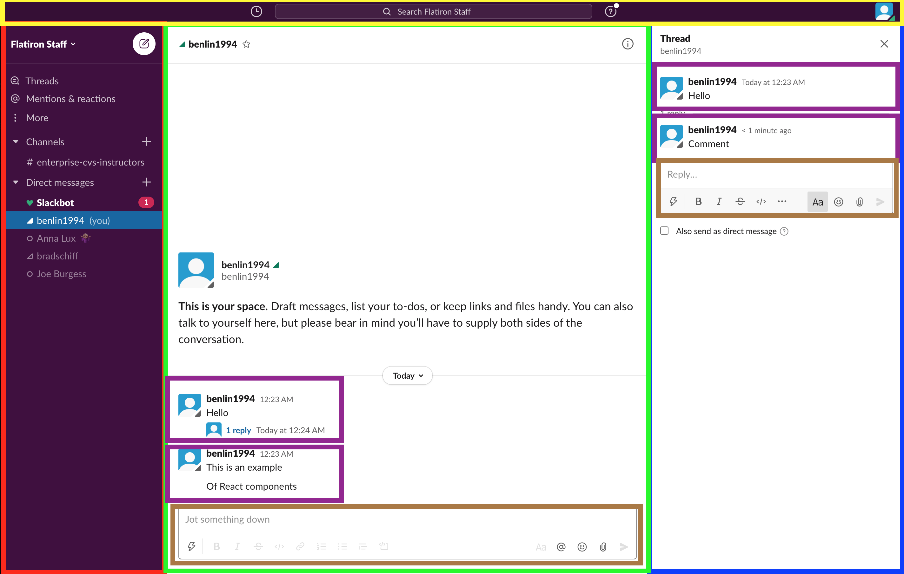
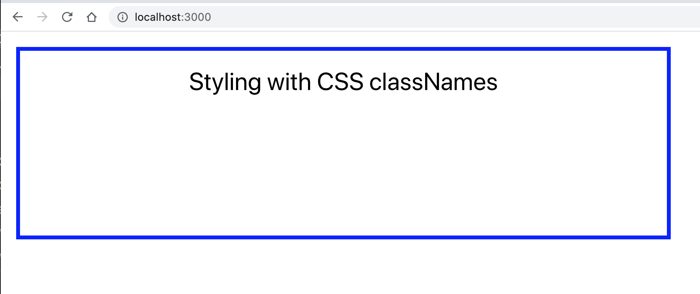

# Unit 4-A Lecture

In this lecture we will cover:
* React Overview
* Setting up a React development environment
* Running our React app locally
* Building a React production build
* HTML and CSS Basics Review
* JSX
* Import and Export
* Creating React functional components
* Passing props to React components
* React Dev Tools

It is recommended to follow along by making a project directory for this lecture and running the code samples:

```
mkdir lecture4A
cd lecture4A
```


## What is React

React.js is a frontend library that allows you to build interactive webpages by piecing together React components - which are reusable functions that describe how the UI should look like based on your application state. 

Here are some reasons why you should use React.js:
* Breaking your UI into React components makes it easier to manage your frontend code
* React applications are incredibly performant at UI rerendering

### Examples of React Components

It is easy to spot React components in modern web applications, just look for parts of the UI that look like they've been reused in some way or parts of the UI that look like they could stand alone.

Here is a screenshot of slack. Can you spot where a React component may be used?



In the image above, every box represents a possible React component. The purple and brown boxes show parts of the UI that may have been reused with React components. Dividing up your UI into components allows you to edit one piece of the UI without having to worry about the rest of the UI. It also allows different developers to work on different parts of the UI at the same time. 

### Virtual DOM - what makes React so fast at rerendering UI

React components are used to generate a Virtual DOM - a light-weight abstraction of the actual HTML DOM. The Virtual DOM is able to be generated much more quickly than the HTML DOM because it does not have to calculate CSS styles and layouts. When a React Component changes state, the Virtual DOM is recreated and the difference between the new Virtual DOM and the previous Virtual DOM is calculated. The React.js library then calculates the most efficient way to update the HTML DOM to reflect these changes. This ends up being much faster than regenerating the entire HTML DOM from the top.

## React quickstart

It is difficult to grasp all of the React concepts without first getting our feet wet and running some React code. This section will do a quick run through of creating your first React component, without explaining much context. We will explain the context later on right after we complete this section.

### Set up

To set up a new React project run:

```
npx create-react-app my-react-project
```

Once that command has finished, cd into your newly formed project:

```
cd my-react-project
```

Next, run the following command to locally host your React app:

```
npm start
```

You should see a spinning React logo at localhost:3000

### Your first edit

Go to App.js, it should look like this:

```jsx
//App.js

import React from 'react';
import logo from './logo.svg';
import './App.css';

function App() {
  return (
    <div className="App">
      <header className="App-header">
        
        <p>
          Edit <code>src/App.js</code> and save to reload.
        </p>
        <a
          className="App-link"
          href="https://reactjs.org"
          target="_blank"
          rel="noopener noreferrer"
        >
          Learn React
        </a>
      </header>
    </div>
  );
}

export default App;
```

In App.js, change Learn React to Hello World and then save the file.

You should see your changes appear instantly in localhost:3000.

### Your first React Component

The most basic React component is just a JavaScript function that returns some HTML.

Create a new file in `/src/Hello.js` with the following contents:

```jsx
//Hello.js
import React from 'react' 

function Hello(){ 
  return (
    <div>My first React component</div> 
  )
}

export default Hello 
```

Lets analyze the 4 steps that are going on:
1. We are importing the React library, which lets us create React components with the special JSX syntax, we will cover JSX later on in this lecture
2. We are defining a React component to be named Hello
3. We are telling our React component to return `<div>My first React component</div>`
4. The Hello component is being exported, we will cover exports more in depth later


### Using your first React Component

Now to use the Hello component we just made, import it into App.js and then replace everything in the return statement with `<Hello/>`:

```jsx
//App.js

import React from 'react';
import logo from './logo.svg';
import './App.css';
import Hello from './Hello.js' //importing Hello component

function App() {
  return (
    <Hello/>
  );
}

export default App;

```

If we go to localhost:3000, we should now see My first React component rendered to the screen.

Congratulations you used created your first React component!

## Creating a React development environment with Create-React-App

**Note:** We will cover exactly how React components are made later in this lecture, but for now we are just covering the development environment and build set up. For now, just think of React components as functions that output HTML.

In the end, React.js files are simply HTML files with some React JavaScript libraries included that are served to the client.

However, developing all of your React code in one giant HTML file with JavaScript script tag snippets is not a good way to structure your code. To take advantage of the modularization of React components, it is a best practice to create a separate file for each of your React components and then bundle them together using some sort of module bundler such as `webpack`.

Luckily, the creators of React have created a React project generator called `create-react-app` that comes with module bundling, a way to serve our React app locally, and other tools to make React development easier.

To create a new react project with `create-react-app`, run the following:

```bash
npx create-react-app your-project-name
```

This will create all the necessary files to get your React development environment up and running in directory you specified. 


Lets take a look at all the files that create-react-app gave you:

```
├── README.md
├── package-lock.json
├── package.json
├── node_modules
├── public
│   ├── favicon.ico
│   ├── index.html
│   ├── logo192.png
│   ├── logo512.png
│   ├── manifest.json
│   └── robots.txt
└── src
    ├── App.css
    ├── App.js
    ├── App.test.js
    ├── index.css
    ├── index.js
    ├── logo.svg
    ├── serviceWorker.js
    └── setupTests.js

```
### package.json

You'll notice that there is a package.json file just like in our Node.js projects. While we aren't writing any server code, we are using npm as a package manager for our React project, which stores our dependencies in package.json. This means we can import any npm modules that we used on the server, such as `axios` and also use them in our React project. Being able to import third party modules is another huge benefit of setting up a React development environment.

### src and public folders
All of your JavaScript and CSS files should be stored in `/src`. 

The `/public` folder is used to hold static assets such as images and logos.

Here are some important files to understand:

`/public/index.html` - this is a mostly blank HTML page template where your React components and bundled source files will be embedded

`/src/App.js` - this holds your main React component. Other React components should be imported into this file.

`/src/index.js` - this file takes your main React component in App.js and renders it into the `public/index.html` file


All the files in both `/public` and `/src` will eventually be bundled together when you create a production build. This will be explained more in depth later in this lecture.

Lets explore those important files more in depth.

#### /public/index.html

The /public/index.html file should look like this:
```html
<!DOCTYPE html>
<html lang="en">
  <head>
    <meta charset="utf-8" />
    <link rel="icon" href="%PUBLIC_URL%/favicon.ico" />
    <meta name="viewport" content="width=device-width, initial-scale=1" />
    <meta name="theme-color" content="#000000" />
    <meta
      name="description"
      content="Web site created using create-react-app"
    />
    <link rel="apple-touch-icon" href="%PUBLIC_URL%/logo192.png" />
    <!--
      manifest.json provides metadata used when your web app is installed on a
      user's mobile device or desktop. See https://developers.google.com/web/fundamentals/web-app-manifest/
    -->
    <link rel="manifest" href="%PUBLIC_URL%/manifest.json" />
    <!--
      Notice the use of %PUBLIC_URL% in the tags above.
      It will be replaced with the URL of the `public` folder during the build.
      Only files inside the `public` folder can be referenced from the HTML.

      Unlike "/favicon.ico" or "favicon.ico", "%PUBLIC_URL%/favicon.ico" will
      work correctly both with client-side routing and a non-root public URL.
      Learn how to configure a non-root public URL by running `npm run build`.
    -->
    <title>React App</title>
  </head>
  <body>
    <noscript>You need to enable JavaScript to run this app.</noscript>
    <div id="root"></div>
    <!--
      This HTML file is a template.
      If you open it directly in the browser, you will see an empty page.

      You can add webfonts, meta tags, or analytics to this file.
      The build step will place the bundled scripts into the <body> tag.

      To begin the development, run `npm start` or `yarn start`.
      To create a production bundle, use `npm run build` or `yarn build`.
    -->
  </body>
</html>

```
Its mostly just generic boilerplate code for setting up a HTML page with some metadata. 

The important thing to note is this line:

```html
    <div id="root"></div>
```

This `div` tag with an id of `root` is where all of your React code will eventually be embedded into. 

#### /src/index.js

The `/src/index.js` file should look like this:

```jsx
import React from 'react';
import ReactDOM from 'react-dom';
import './index.css';
import App from './App';
import * as serviceWorker from './serviceWorker';

ReactDOM.render(
  <React.StrictMode>
    <App />
  </React.StrictMode>,
  document.getElementById('root')
);

// If you want your app to work offline and load faster, you can change
// unregister() to register() below. Note this comes with some pitfalls.
// Learn more about service workers: https://bit.ly/CRA-PWA
serviceWorker.unregister();
```

There's a lot of stuff we won't understand yet, but the main thing to know is that ReactDOM.render is used to render our React components into our index.html page here:

```jsx
ReactDOM.render(
  <React.StrictMode>
    <App />
  </React.StrictMode>,
  document.getElementById('root')
);

```
In the code snippet above, the `ReactDOM.render()` method is used to render `<App/>` into `document.getElementById('root')`, which is specifying that div tag with the id of `root `that we saw earlier in the index.html page. This is the line of code that takes our React components and embeds them into our HTML page.

#### /src/App.js

The `/src/App.js` file should look like this:

```jsx
//App.js

import React from 'react';
import logo from './logo.svg';
import './App.css';

function App() {
  return (
    <div className="App">
      <header className="App-header">
        
        <p>
          Edit <code>src/App.js</code> and save to reload.
        </p>
        <a
          className="App-link"
          href="https://reactjs.org"
          target="_blank"
          rel="noopener noreferrer"
        >
          Learn React
        </a>
      </header>
    </div>
  );
}

export default App;
```

Again, there's alot of stuff we might not understand. The key thing to know is that App is a React component. React components may seem complicated at first, but they are just JavaScript functions that return HTML. Because they are functions, they can be reused if we ever need to repeat portions of the UI. 

React components by themselves are just definitions, they have to be rendered to an HTML page in order to have their output displayed. That is what happens in the index.js file. It is importing this React component and then rendering it into a specific `<div>` inside index.html.

## Knowledge Check 1

Which file will your React components be embedded in?
```
A. /public/index.html
B. /src/App.js
C. /src/index.js
D. package.json
```


## Serving our React app locally in development mode

We can run our React app locally in development mode by running:

```
npm start
```

This will trigger a npm script that was defined in package.json which will set up a development server with hot reloading on localhost:3000. The development server will automatically host your React application with no configuration needed, but you won't be able to set up any express API's though.

With hot reloading, any saved changes you make to your source files will automatically be detected and injected into your React App - meaning that you should see your changes instantaneously without having to restart your React app.

Try editing `/src/App.js` and change `Learn React` to `Hello World`. Once you save, you should see the changes appear on localhost:3000.


## Making a production build

Although `npm run start` with hot reloading is great for local testing, we should never deploy that in production. Instead we need to create a production build that we can serve from hosted Express server or cloud provided static serving solution.

A production build is just a folder that includes your all React.js and .css files bundled together an HTML file.


If you want to make a production, you can run:

```
npm run build
```

After the command completes, you will notice that there is now a `/build` folder in your project directory.

The `/build `project folder structure should look like this:
```
build
├── asset-manifest.json
├── favicon.ico
├── index.html
├── logo192.png
├── logo512.png
├── manifest.json
├── precache-manifest.790f6d3155e7315d4e040763068dc8ad.js
├── robots.txt
├── service-worker.js
└── static
    ├── css
    │   ├── main.5f361e03.chunk.css
    │   └── main.5f361e03.chunk.css.map
    ├── js
    │   ├── 2.58a9c78f.chunk.js
    │   ├── 2.58a9c78f.chunk.js.LICENSE.txt
    │   ├── 2.58a9c78f.chunk.js.map
    │   ├── main.0b582337.chunk.js
    │   ├── main.0b582337.chunk.js.map
    │   ├── runtime-main.77955cfc.js
    │   └── runtime-main.77955cfc.js.map
    └── media
        └── logo.5d5d9eef.svg

```
This `/build` folder contains all of the files necessary to serve your React project statically, whether its through a hosted Express server, AWS S3, Netlify, or some other cloud solution for hosting static builds.

You'll notice that your App.js and other React.js files are missing from the `/build` folder. If you look in the `/static` folder you'll see a bunch of oddly named .js and .css files instead. These are the bundled versions of all the React.js and .css files that were in our `/src` folder. Bundling all your `/src`folder files combines them all into fewer files and also removes whitespace to decrease the file size. These bundled files will be embedded in the `/build/index.html` file which will be the main entrypoint to your React application production build.

You'll also notice that all of your static assets in your `/public` folder are available in the `/build` folder. Any static assets (images, logos, etc.) that are now in the `/build` folder should be able to be referenced by any of the bundled .js files.

Lets try serving our production build using `serve`. `serve` is a third party npm module that lets us statically serve an entire build folder locally without having to set up an entire server like in Express. 

To install `serve`:

```
npm install serve -g
```

Then you can serve your build folder with (do this is in your root, not your build folder):
```
serve -s build
```

Then go to localhost:5000 to see your production build in action!

**Warning**: Your production build won't have hot reloading, you will have to rebuild it with `npm run build` and then re-serve it with `serve -s build` whenever you make any edits.


## HTML and CSS Review

This section will review just enough HTML and CSS that is necessary to understand React. JSX, which we will cover later, borrows heavily from HTML syntax.

### Basic HTML Elements

HTML is used to define the structure of how a web page look like. The basic building blocks of HTML are called HTML elements.

HTML elements are made up of tags, which are strings that are surrounded by <>'s such as:

```html
<div>This is a div tag.</div>
<h1>This is a header tag</h1>
<p>This is a paragraph tag</p>
```

Each element has a beginning and closing tag, as well as content in between the two tags.

### Nested Elements

You are allowed to have nested elements within other elements such as:

```html
<div>
    <p>Content</p>
    <div>
        Nested Content
        <div>More Nested Content<div>
    </div>
</div>
```

### Common HTML elements

Here are list of common HTML elements:
* `<div>` - used to make a basic section
* `<p>` - used for paragraph text
* `<h1>` - used for headers (can use h1-h6 for varying font size)
* `<a>`- used for links
* `` - used for images
* `<button` - for clickable buttons
* `<input>` - for input forms
* `<li>` - list item, can be bulleted or numbered 
* `<table>` - used to create tables


### HTML element attributes

Attributes can be attached to HTML elements to pass additional information:

```html
<div id="123" class="item" height=400 width=200>Hello</div>

<a href="https://www.w3schools.com">Visit W3Schools</a>
```

### Single Tags

In the case that you don't want to have any nested content, you can use a single tag:

```html

```

**Additional Context:** React components will often use single tags.

### Basic CSS

CSS is used to define the styling of your web page. CSS gets applied as rules to your HTML elements.

CSS rules come as key-value pairs of CSS attributes and values.

Visit this link for a complete list of CSS attributes:
https://www.w3schools.com/cssref/

Here is an example of some basic CSS code:

```css
h1 {
  color: white;
  text-align: center;
}

p {
  font-family: verdana;
  font-size: 20px;
}

#myId {
   height: 100;
   width: 200;
}

.myClass {
   background-color: lightblue;
   height: 100;
   width: 200;
}
```

The value before the {}'s is called a CSS selector and it defines where the CSS rule is going to be applied. If the selector is a standard HTML element name, that means the CSS rule will be applied to all HTML elements of that type(e.g. p's and h1's). 

If there is a # in front the selector, the rule will apply to any HTML elements with an id attribute equal to the selector.

If there is a . in front of the selector, the rule will apply to any HTML elements with a class attribute equal to to the selector.

## Knowledge Check 2

True or false? You can embed HTML elements within other HTML elements
```
A. True
B. False
```

## JSX

JSX is a syntax extension to JavaScript that allows React Elements to be written inside JavaScript using HTML tags.

Lets take a look at our default `/src/App.js` , which uses JSX:

```jsx
//App.js

import React from 'react';
import logo from './logo.svg';
import './App.css';

function App() {
  return (
    <div className="App">
      <header className="App-header">
        
        <p>
          Edit <code>src/App.js</code> and save to reload.
        </p>
        <a
          className="App-link"
          href="https://reactjs.org"
          target="_blank"
          rel="noopener noreferrer"
        >
          Learn React
        </a>
      </header>
    </div>
  );
}

export default App;
```

What's going on in our App.js code? It looks like we have a function named App(), but somehow it returns some HTML instead of JavaScript. This is how JSX works, it allows you to combine HTML elements and JavaScript together. HTML elements can even be saved as variables and passed around. In the end, our App React component returns some HTML, that will later be rendered onto our index.html page. 

### Using JSX with JavaScript Expressions

Lets replace App.js with the following code:
```jsx
//App.js

import React from 'react'

let foo = <p>Hello World</p>

let item = {
    name: "Cheese",
    price: 5
}

let bar = <p>{item.name} : ${item.price} </p>


let length = 20
let width = 10

function calculateArea(x,y){
    return x * y
}

let qux = <div>The Area is: {calculateArea(length,width)}</div>


function App() {
  return (
    <div>
      {foo}
      {bar}
      {qux}
    </div>
  );
}

export default App
```

In this example, we are storing HTML elements into variables named `foo`, `bar`, and `qux`.

Just as JSX allows us to embed HTML elements inside JavaScript, we can also embed JavaScript variables and expressions inside HTML elements. 

To do so, we can use curly brances to indicate to JSX that we want to evaluate a JavaScript expression thats embedded with an HTML element.

As a result, `foo` will evaluate to `<p>Hello World</p>`,`bar` will evaluate to `<p>Cheese : $5</p>` and `qux` will evaluate to `<div>The Area is :200</div>` and it will be as if we put those HTML elements in between the `<div>` tags to begin with.


JSX doesn't come enabled by default. JSX files have to be compiled down to JavaScript using a transpiler such as Babel. Luckily, `create-react-app` transpiles all JSX files automatically for us. 


### Embedding attributes

A common practice with JSX is to pass JavaScript variables down as attributes to HTML elements


Lets replace App.js with the following code:
```jsx
//App.js

import React from 'react'

var imgSrc = "./logo192.png"

function App() {
  return (
    <div>
      
    </div>
  );
}

export default App
```
In this example, we stored a string into the variable `imgSrc`. Then we passed the `imgSrc` variable to the src attribute of the `` element. Since we used curly brances, imgSrc was evaluated to the string it contained and in the end `./logo192.png` was used by the src attribute to indicate where the image source lived.

JSX also allows you to pass in strings directly instead of using variables:

```jsx

```

**Warning:** However, don't try to pass in curly braces surrounded by strings, this will cause the curly brances to be evaluated as part of the string:

```jsx
//DON'T DO THIS!

```


### JSX with Nested Elements

You can also assign a nested group of HTML elements to a JavaScript variable in JSX:

```jsx
//App.js
import React from 'react'

let nested = (
    <div>
        <h1>Header</h1>
        <div>
            <h2>Sub Header</h2>
            <p>Content</p>
        </div>
    </div>
)

function App() {
  return (
    <div>
      {nested}
    </div>
  );
}

export default App
```

**Warning:** However, there must be **only** one root element that surrounds the rest of the nested elements. 

You can not have two top level root elements.

For example, this will cause React to throw an error:

```jsx
//App.js
import React from 'react'

//nested doesn't have a single root element
let nested = (
        <h1>Header</h1>
        <div>
            <h2>Sub Header</h2>
            <p>Content</p>
        </div>
)

function App() {
  return (
    <div>
      {nested}
    </div>
  );
}

export default App
```

```
./src/App.js
  Line 5:9:  Parsing error: Adjacent JSX elements must be wrapped in an enclosing tag. Did you want a JSX fragment <>...</>?

  3 | let nested = (
  4 |         <h1>Header</h1>
> 5 |         <div>
    |         ^
  6 |             <h2>Sub Header</h2>
  7 |             <p>Content</p>
  8 |         </div>

```


### Style in JSX

### Styling with a separate CSS file and className
To add CSS the traditional way, with a separate CSS file and class names, use the `className` attribute.


Replace `App.css` with the following:
```css
.MyClass {
  text-align: center;
  font-size: 32px;
  border: 5px solid blue;
  width: 800px;
  height: 200px;
  margin: 20px;
  padding: 20px;
}
```


Replace App.js with the following:
```jsx
//App.js

import React from 'react'
import './App.css'

function App() {
  return (
    <div className="MyClass">
      Styling with CSS classNames
    </div>
  );
}

export default App
```

To import the App.css file we need to use `import ./App.css`. We will cover imports later on in more depth.

Next in App.js, we just have assign the className attribute on the div element to equal the `MyClass` selector that we defined in `App.css`.

If we check out localhost:3000, we should see the following:



In JSX we use the `className` attribute instead of `class` for CSS styling because the class keyword is already reserved for creating JavaScript classes.


### JSX Styling with Style Objects

An alternative way to add CSS styling is to use pass a Style object to the `style` attribute of an HTML element. This method does not require an external CSS file. 

Replace App.js with the following
```jsx
//App.js

import React from 'react'
import './App.css'

let style = { 
  textAlign: "center",
  fontSize: "32px",
  border: "5px solid blue",
  width: "800px",
  height: "200px",
  margin: "20px",
  padding: "20px"
}

function App() {
  return (
    <div style={style}>
      Styling with CSS classNames
    </div>
  );
}

export default App
```
In App.js, we defined a style object in JavaScript and passed that to the style attribute of the `<div>` element.

If you go to localhost:3000, you'll notice the same result as our example using styling with classNames. 

However, our style object needed to have a different syntax than our original CSS definition because we are writing it in JavaScript. All of the values have to be strings wrapped in quotes and the semicolons we used in CSS have to be replaced with commas. Lastly, all CSS properties with more than one word were written using caterpillar-case(e.g. font-size) while all properties using JavaScript have to use camelCase(e.g. fontSize)

**Warning:** If you want to pass a style object directly, intsead of using a variable to hold the object, you'll need to use two sets of curly braces. The first curly brace is for the JSX expression evaluation, the second is for the object itself:


```jsx
//App.js

import React from 'react'
import './App.css'


function App() {
  return (
    <div style={{ 
      textAlign: "center",
      fontSize: "32px",
      border: "5px solid blue",
      width: "800px",
      height: "200px",
      margin: "20px",
      padding: "20px"
    }}>
      Styling with CSS classNames
    </div>
  );
}

export default App
```

## Knowledge Check 3

How do you evaluate JavaScript expressions within HTML elements in JSX?

```
A. Surround the JavaScript expression with ${}
B. Surround the JavaScript expression with {}
C. Surround the JavaScript expression with "{}"
D. Surround the JavaScript expression with {{}}
```

## Basic React Components

As we saw earlier in the quickstart section, a basic React component is just a JavaScript function that returns some HTML.

Example of a Basic React component
```jsx
//Hello.js
import React from 'react' 

function Hello(){ 
  return (
    <div>My first React component</div> 
  )
}
export default Hello 
```

In order to create an instance of the React component, we have to surrounded it by <>'s and make it look like an HTML tag:

```jsx
//App.js

import React from 'react';
import logo from './logo.svg';
import './App.css';
import Hello from './Hello.js' //importing Hello component

function App() {
  return (
    <Hello/>
  );
}

export default App;
```

If your React component doesnt need to be wrapped around any content, you can wrap it with a single tag.

You can resuse the component by making multiple instances of the React component:

```jsx
//App.js

import React from 'react';
import logo from './logo.svg';
import './App.css';
import Hello from './Hello.js' //importing Hello component

function App() {
  return (
    <div>
      <Hello/>
      <Hello/>
      <Hello/>
    </div>
  );
}

export default App;
```

Now localhost:3000 should show `My first React component` three times.

**Warning:** Be sure that there's only one root element being returned from any React component

## Passing Props to React Components

We can also pass properties called `props` to React components similarly to how we can pass arguments to a function.

We first have to define how the function is going to use its `props`:

```jsx
//Hello.js
import React from 'react' 

function Hello(props){ 
  return (
    <div>Name: {props.name} Age: {props.age}</div> 
  )
}

export default Hello 
```

In the above example, the Hello component will return a div element that contains the values of `props.name` and `props.age`.

We also have to make sure that we are adding `props` as a parameter to the function. `props` wont work otherwise.

Next, to pass props to a React component, pass them in as attributes when you are creating an instance of the component:


```jsx
//App.js

import React from 'react';
import logo from './logo.svg';
import './App.css';
import Hello from './Hello.js' //importing Hello component

function App() {
  return (
    <Hello name={"bob"} age={42}/>
  );
}

export default App;

```

This will pass the values of "bob" and 42 to props.name and props.age respectively. 

The end result will show `Name: bob Age: 42` in localhost:3000.


The following example illustrates how we can resuse React components as UI templates, we just have to pass in different props:

```jsx
//App.js

import React from 'react';
import logo from './logo.svg';
import './App.css';
import Hello from './Hello.js' //importing Hello component

function App() {
  return (
    <div>
      <Hello name={"bob"} age={42}/>
      <Hello name={"sally"} age={35}/>
      <Hello name={"joe"} age={28}/>

    </div>
  );
}

export default App;

```

## Knowledge Check 4


```jsx
//App.js
import React from 'react' 

function Message(props){ 
  return (
    <div>Once upon a time there was a props.value</div> 
  )
}

function App(){
  <Message value="cat"/>
}
export default App
```

What will the App() render?

```
A. Once upon a time there was a cat
B. Once upon a time there was a props.value
C. Once upon a time there was a 
D. Nothing
```

### Import and Export

In our previous lectures, we learned about using `require()` and `module.exports` with Node.js files.

In React files, `import` is used instead of `require()` and `export` is used instead of module.exports.


#### export default

Use `export default` to specify what the main export of your file will be:
```js
import React from 'react'

function Component(){
  return (
    <div>Hello World</div>
  )
}

export default Component
```

You can import a default export with `import`:

```jsx
import ComponentDefault from './Component.js';
```

When you import a component that has a default export, you don't have to name the imported component the same name as the default export. You can name it anything you want and the default component will be stored in that variable name.


#### named exports

You can only export up to one default export, however you can export as many additional `named exports` as you want:

```js
import React from 'react'

//component
function Component(){
  return (
    <div>Hello World</div>
  )
}


function ComponentOne(){
  return (
    <div>One</div>
  )
}


function ComponentTwo(){
  return (
    <div>Two</div>
  )
}


export default Component
export {ComponentOne,ComponentTwo}
```

To import `named exports`, use the following syntax:

```jsx
import ComponentDefault, {ComponentOne, ComponentTwo} from './Component.js';
```

Named exports must be specified using curly braces and must have the same name as the one they were assigned when they were exported.

You can import and export default exports and named exports at the same time.

#### Importing npm modules

To import a npm module, just provide the module name without any filepath:

```js
import React, {useState} from 'react'
import ReactDOM from 'reactDOM'
```

Just make sure you read the npm module documentation so you know what the default export and named exports are supposed to be.

You also have to install the npm modules as dependencies with `npm install` before they can be used in your React files.

## React Dev Tools

The React Dev Tools chrome extension is a tool that allows you to debug React applications easier

You can download React Dev Tools here:
https://chrome.google.com/webstore/detail/react-developer-tools/fmkadmapgofadopljbjfkapdkoienihi?hl=en

Once you downloaded the Chrome extension, there will be two new tabs on your dev tools: Components and Profiler(experimental mode)

The Components tab shows you the root React components that were rendered on the page, as well as the subcomponents that they ended up rendering.


By selecting one of the components in the tree, you can inspect and edit its current props and state in the panel on the right. In the breadcrumbs you can inspect the selected component, the component that created it, the component that created that one, and so on.

You can read more about the experimental Profiler tool here:
https://reactjs.org/blog/2018/09/10/introducing-the-react-profiler.html


# Unit 4-A Lab

## Lab Overview

## Lab Starter Code

## Lab Solution

# Knowledge Check Answers

## Knowledge Check 1

Which file will your React components be embedded in?
```
A. /public/index.html
B. /src/App.js
C. /src/index.js
D. package.json
```

Answer is A.

## Knowledge Check 2

True or false? You can embed HTML elements within other HTML elements
```
A. True
B. False
```

Answer is A.

## Knowledge Check 3

How do you evaluate JavaScript expressions within HTML elements in JSX?

```
A. Surround the JavaScript expression with ${}
B. Surround the JavaScript expression with {}
C. Surround the JavaScript expression with "{}"
D. Surround the JavaScript expression with {{}}
```

Answer is B.


## Knowledge Check 4


```jsx
//App.js
import React from 'react' 

function Message(props){ 
  return (
    <div>Once upon a time there was a props.value</div> 
  )
}

function App(){
  <Message value="cat"/>
}
export default App
```

What will the App() render?

```
A. Once upon a time there was a cat
B. Once upon a time there was a props.value
C. Once upon a time there was a 
D. Nothing
```

Answer is B.