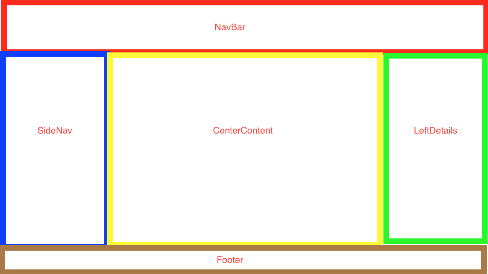

# Unit 4-C Lecture

In this lecture we will cover:
* Lists and Keys
* Tables
* Forms
* Composition


It is recommended to follow along by making a project directory for this lecture and running the code samples:

```
mkdir lecture4C
cd lecture4C
```

## Lists and Keys

In modern UI's it is very common to see lists of repeated UI templates. You can find them shopping carts, catalog pages, dropdown menus, and other many places.  These lists can be created in React as well.

In React, you can create a list of items by taking an array of data and mapping that array into an array of React components:


```jsx
//App.js
import React from 'react'

function App(){
    let itemsList = [
        {name:"apple",price:3.50},
        {name:"banana",price:4.25},
        {name:"carrot",price:2.00}

    ]
    return (
        <ul>
            {
            itemsList.map((x,i) => <li key={i}>name: {x.name} | price: {x.price}</li>)
            }
        </ul>
    )
}

export default App
```

In the above example, the items in itemsList were each mapped out to become react elements with the following format:

```jsx
<li key={i}>name: {x.name} | price: {x.price}</li>
```
The surrounding `<ul>` element made the `<li>` elements bulleted.

You will also notice that there is a `key` attribute added. Keys help React identify which items have changed, are added, or are removed and help with efficient rerendering of the list. 

**Best Practice:** Ideally you should use a UUID as the key, but you can use an array index as a last resort if you have nothing better to use. 

### List Item Components

It is a best practice to create a React component that will represent one individual item in a list. This way, if you want to edit the Item component, you can just edit the component's file instead of searching through the map() function.

Lets create an React component to represent an Item in our itemsList from the previous example:

```jsx
//Item.js

import React from 'react'

function Item(props){
    return (
        <li>name: {props.name} | price: {props.price}</li>
    )
}

export default Item


```

Now we can map each item in the array to an Item component and pass in any relevant props:

```jsx
//App.js
import React from 'react'
import Item from './Item.js'

function App(){
    let itemsList = [
        {name:"apple",price:3.50},
        {name:"banana",price:4.25},
        {name:"carrot",price:2.00}

    ]
    return (
        <ul>
            {
            itemsList.map((x,i) => <Item key={i} name={x.name} price={x.price}/>)
            }
        </ul>
    )
}

export default App
```

This makes the map() function easier to read.

You'll notice we kept the `key` attribute on `<Item/>` instead of the `<li>` within `<Item/>`. Generally, you should put the key on the component that the array data is being mapped into.

If we want to pass in all attributes at the same time, a shorthand way to do that is by using the spread operator:
```jsx
    itemsList.map((x,i) => <Item key={i} {...x}/>)
```

### Tables


Tables are essentially lists of items as well.

A simple table in HTML looks like this:

```html
<table style="width:100%">
  <tr>
    <th>Firstname</th>
    <th>Lastname</th>
    <th>Age</th>
  </tr>
  <tr>
    <td>Jill</td>
    <td>Smith</td>
    <td>50</td>
  </tr>
  <tr>
    <td>Eve</td>
    <td>Jackson</td>
    <td>94</td>
  </tr>
</table>
```

The `<th>` element indicates a table header while the `td` element indicates table data.

Try passing it into App.js and seeing the result:

```jsx
//App.js
import React from 'react'

function App(){
    return (
        <table border={"1px solid black"}>
            <tr>
                <th>Full Name</th>
                <th>Description</th>
                <th>Going?</th>
            </tr>
            <tr>
                <td>Jill Smith</td>
                <td>Black Hair, 5.5 inches tall, 50 years old</td>
                <td>Yes</td>
            </tr>
            <tr>
                <td>Eve Jackson</td>
                <td>Red Hair, 5.2 inches tall, 94 years old</td>
                <td>No</td>
            </tr>
        </table>
    )
}

export default App
```
localhost:3000 shows a table, but there should be a better way to create a table than manually entering the table data.


Lets create two React components to model the data shown in the HTML table example above, one for the Table Header and one each Table Body:

TableHeader.js:
```jsx
//TableHeader.js
import React from 'react'

function TableHeader(){
    return (
        <tr>
            <th>Full Name</th>
            <th>Description</th>
            <th>Going?</th>
        </tr>
    )
}
export default TableHeader

```

TableBody.js:

```jsx
//TableBody.js
import React from 'react'

function TableBody(props){
    return (
        <tr>
            <td>{props.full_name}</td>
            <td>{props.description}</td>
            <td>{props.isGoing? "yes" : "no"}</td>
        </tr>
    )
}
export default TableBody
```

Now lets create another React component, `Table.js`, to piece them together:

Table.js:

```jsx
//Table.js
import React from 'react'
import TableHeader from './TableHeader.js'
import TableBody from './TableBody.js'

function Table(props){
    return (
        <table border={"1px solid black"}>
            <TableHeader/>
            {
                props.people.map( person => <TableBody {...person}/>)
            }
        </table>
    )
}

export default Table
```

Now lets pass Table into App.js and pass some data in:

```jsx
//App.js
import React from 'react'
import Table from './Table.js'

function App(){
    let peopleList = [
        {full_name:"Jill Smith",description:"Black Hair, 5.5 inches tall, 50 years old",age:50},
        {full_name:"Eve Jackson",description:"Red Hair, 5.2 inches tall, 94 years old"},

    ]
    return (
        <Table people = {peopleList} />
    )
}

export default App
```
Now, if we go to localhost:3000, we should see a Table just like the example. Except, this time we used React components to create a Table that can render based on an array on input data.

## Forms

Here is how to make a basic input form in React:

```jsx
//App.js
import React from 'react'

function App(){

    return (
        <input />
    )
}

export default App
```

If we go to localhost:3000, we can see the input form and type it in. However, we can't really do anything with the data we enter at the moment. This is because the data is stored by the DOM instead of our React component at the moment.

## Controlled Components

There are several types of HTML elements that store their own data in the DOM:

* `<input>` - for short string of text
* `<select>` - for dropdown lists
* `<textarea>`- for entering large paragraphs of text

In React, it is a best practice to have React be the source of truth for all state data. Therefore, we want to somehow tie the DOM data from user input HTML elements such as `<input>` into the React component state. When we do this, we are creating a Controlled Component.

Here's the basic code for creating a Controlled Component.

```jsx
//App.js
import React, {useState} from 'react'

function App(){
    const [val,setVal] = useState("")
    const handleChange = (e) => {
        console.log(val)
        setVal(e.target.value)
    }
    return (
        <input value = {val} onChange={handleChange} />
    )
}

export default App
```

Now if we go to localhost:3000 and type in the input form, we can see that the console is logging whatever we are typing into the box.

Here's how we transformed our Uncontrolled Component into a Controlled Component:
1. We used useState() to create a state variable named `val` to hold the input data
    1. The initial state value was an empty string
    2. The `setVal` method was created to update the state in `val`
2. We created an event handler to update `val` to be the value in the input form
3. We tied the value of the input form with `val` so that our React state is the source of truth for the input form displayed text.

**Additional Context**: When doing any sort of event handling, an event object, `e`, will be passed down as an argument to the event handler. `e.target` will usually contain the information you need, including the target value.

## Handling Multiple Forms

What if we want to handle multiple form inputs? Do we set a useState() variable for each input?

We could do that, however there is a better way that involves using one state object that holds all the different form input values as properties.


```jsx
//App.js
import React, {useState} from 'react'

function App(){
    const [val,setVal] = useState({
      full_name:"default name",
      description:"default description",
      isGoing:false
    })
    const handleChange = (e) => {
        const target = e.target;
        const value = target.type === 'checkbox' ? target.checked : target.value;
        const name = target.name;
        
        let temp = {...val}
        temp[name] = value
        console.log(temp)

        setVal(temp)
    }
    return (
        <div>
            <h1>Full Name</h1>
            <input name = "full_name" value= {val.full_name} onChange={handleChange} />

            <h1>Description</h1>
            <textarea name = "description" value = {val.description} onChange={handleChange} />

            <h1>Going?</h1>
            <input name = "isGoing" type="checkbox" checked = {val.isGoing} onChange={handleChange} />
        </div>

    )
}

export default App

```
What did we do here?
1. We made the component return three different input elements:
    * input
    * textarea
    * checkbox
2. We changed the state value to be an object with three properties to represent the three different input state values. We also added some empty default values.
3. We modified the `value` attribute on each of the input elements to only take the state property that represented its input state.
4. We added a `name` attribute to each of the input elements that is the same as the property name on the state object for that input element. This allows us to pass a `name` in the `onChange` event handler and use it to assign the appropriate property on the state object.


**Additional Context**: When doing any sort of event handling, an event object, `e`, will be passed down as an argument to the event handler. `e.target` will usually contain the information you need, including the target name and target value.

**Note:** You can turn an `<input>` element into a checkbox by assigning its `type` attribute to be `checkbox`. Checkboxes use `target.checked` instead of `target.value` to hold its input value, so we had to add some simple logic to get the appropriate value out of the target.
```js
    const value = target.type === 'checkbox' ? target.checked : target.value;
```


## Submitting Form Values with Buttons

We usually want to have a button that will allow us to do something with our form input data, whether thats to insert it to a database or add it to a list.

We can do that by adding a click event handler to a `<button>` element. This way, when a user clicks the button, the click event handler will access our form data through our state and then do whatever processing is necessary on the form data:


```jsx
//App.js
import React, {useState} from 'react'

function App(){
    const [val,setVal] = useState({
      full_name:"",
      description:"",
      isGoing:false
    })
    const handleChange = (e) => {
        const target = e.target;
        const value = target.type === 'checkbox' ? target.checked : target.value;
        const name = target.name;
        
        let temp = {...val}
        temp[name] = value
        console.log(temp)

        setVal(temp)
    }

    const handleClick = (e) => {
        alert(val)
    }
    return (
        <div>
            <h1>Full Name</h1>
            <input name = "full_name" value= {val.full_name} onChange={handleChange} />

            <h1>Description</h1>
            <textarea name = "description" value = {val.description} onChange={handleChange} />

            <h1>Going?</h1>
            <input name = "isGoing" type="checkbox" checked = {val.isGoing} onChange={handleChange} />
            <div>
                <button onClick={handleClick}>Submit</button>
            </div>
        </div>

    )
}

export default App

```
For now, we just added the button and made the click event handler send an alert() with the form data information.

Now lets add the current form data information to a list, and then render the list information using the Table component we made earlier. We also, will wipe the form data back to empty defaults after each form submit.

```jsx
//App.js
import React, {useState} from 'react'
import Table from './Table.js'

function App(){
    const [peopleList,setPeopleList] = useState([])
    const [val,setVal] = useState({
      full_name:"",
      description:"",
      isGoing:false
    })
    const handleChange = (e) => {
        const target = e.target;
        const value = target.type === 'checkbox' ? target.checked : target.value;
        const name = target.name;
        
        let temp = {...val}
        temp[name] = value
        console.log(temp)

        setVal(temp)
        
    }

    const handleClick = (e) => {
        console.log(peopleList)
        setPeopleList([...peopleList,val])
        setVal({
            full_name:"",
            description:"",
            isGoing:false
        })
    }
    return (
        <div>
            <h1>Full Name</h1>
              <input name = "full_name" value= {val.full_name} onChange={handleChange} />

              <h1>Description</h1>
              <textarea name = "description" value = {val.description} onChange={handleChange} />

              <h1>Going?</h1>
              <input name = "isGoing" type="checkbox" checked = {val.isGoing} onChange={handleChange} />
              <div>
                <button onClick={handleClick}>Submit</button>
              </div>
              <Table people={peopleList}/>
        </div>

    )
}

export default App

```
In the above example, we added the following things:
1. Imported Table.js
2. Added a state variable for holding our list of people named peopleList
    1. Set the default state for peopleList to be an empty array
    2. Created, setPeopleList() which can be used to change the state of peopleList
3. edited handleClick so that it appends the input form state value onto the end of peopleList and saves that new value with setPeopleList()
4. Rendered a Table component at the bottom and passed peopleList as a `props`


Now if we go to localhost:3000 and press the Submit button, a new row with the current form data gets added to our table!

### Removing Items from a List

A common use case is deleting items from a list. Lets edit our code to implement this feature:


In App.js, create an event handler called `deletePerson()` that will delete a specific index from the peopleList state array. Then pass it down as props to Table:

```jsx
//App.js
import React, {useState} from 'react'
import Table from './Table.js'

function App(){
    const [peopleList,setPeopleList] = useState([])
    const [val,setVal] = useState({
      full_name:"default name",
      description:"default description",
      isGoing:false
    })
    const handleChange = (e) => {
        const target = e.target;
        const value = target.type === 'checkbox' ? target.checked : target.value;
        const name = target.name;
        
        let temp = {...val}
        temp[name] = value
        console.log(temp)

        setVal(temp)
    }

    const handleClick = (e) => {
        console.log(peopleList)
        setPeopleList([...peopleList,val])
        setVal({
            full_name:"",
            description:"",
            isGoing:false
        })
    }

    const deletePerson = (index) => {
        setPeopleList([...peopleList.slice(0,index),...peopleList.slice(index + 1,peopleList.length)])
    }
    return (
        <div>
            <h1>Full Name</h1>
              <input name = "full_name" value= {val.full_name} onChange={handleChange} />

              <h1>Description</h1>
              <textarea name = "description" value = {val.description} onChange={handleChange} />

              <h1>Going?</h1>
              <input name = "isGoing" type="checkbox" checked = {val.isGoing} onChange={handleChange} />
              <div>
                <button onClick={handleClick}>Submit</button>
              </div>
              <Table deletePerson={deletePerson} people={peopleList}/>
        </div>

    )
}

export default App

```

Next, edit TableHeader to have a Delete column:

```js
//TableHeader.js
import React from 'react'

function TableHeader(){
    return (
        <tr>
            <th>Full Name</th>
            <th>Description</th>
            <th>Going?</th>
            <th>Delete</th>
        </tr>
    )
}
export default TableHeader

```
Next, edit Table so that it passes down the deletePerson method it received as props down again to each TableBody. Also pass the index of each TableBody down as props.

```jsx

//Table.js
import React from 'react'
import TableHeader from './TableHeader.js'
import TableBody from './TableBody.js'

function Table(props){
    return (
        <table border={"1px solid black"}>
            <TableHeader/>
            {
                props.people.map( (person,i) => <TableBody id={i} deletePerson={props.deletePerson} {...person}/>)
            }
        </table>
    )
}
export default Table
```

Lastly, edit TableBody to have a new column with a Delete Button, then create a new event handler named handleClick() and attach it to the onClick attribute of the Delete Button you just created. Lastly, within handleClick, call the deletePerson() method that was passed down as props and pass in the TableBody id that was also passed as props.


```jsx
//TableBody.js
import React from 'react'

function TableBody(props){
    const handleClick = () => {
        props.deletePerson(props.id)
    }
    return (
        <tr>
            <td>{props.full_name}</td>
            <td>{props.description}</td>
            <td>{props.isGoing? "yes" : "no"}</td>
            <td><button onClick={handleClick}>Delete</button></td>
        </tr>
    )
}
export default TableBody
```

Here's a summary of what we did:
1. Create a event handler called deletePerson() in App.js
    1. Also pass down the deletePerson() event handler as props to Table
2. Edit TableHeader to have a Delete column
3. Edit Table so that it passes id props to each TableBody
    1. Pass the deletePerson() event handler that was passed down as props again as props to each TableBody
4. Edit TableBody to have a new column with a Delete Button, then create a new event handler named handleClick() and attach it to the onClick attribute of the Delete Button you just created. Lastly, within handleClick, call the deletePerson() method that was passed down as props and pass in the TableBody id that was also passed as props.

If we go to localhost:3000, we can now see a Delete Button in each row of the table. Clicking on the Delete button then removes the row item from the table.


### Styling it up

Our input form and table display doesn't look the greatest style-wise.

Lets add some styling to make it look better.

Lets define some styling in App.css:

```css

.App {
  margin: 20px;
}

.Input {
  width:200px;
  height:40px;
}

.TextArea {
  width:400px;
  height:80px;
}

.Checkbox {
  width: 40px;
  height:400px
}

.Button {
  margin-top:20px;
  margin-bottom:20px;
  width: 80px;
  height:30px
}

```

Next, lets apply the CSS into our App.js file:

```jsx
//App.js
import React, {useState} from 'react'
import Table from './Table.js'
import './App.css'

function App(){
    const [peopleList,setPeopleList] = useState([])
    const [val,setVal] = useState({
      full_name:"",
      description:"",
      isGoing:false
    })
    const handleChange = (e) => {
        const target = e.target;
        const value = target.type === 'checkbox' ? target.checked : target.value;
        const name = target.name;
        
        let temp = {...val}
        temp[name] = value
        console.log(temp)

        setVal(temp)
    }

    const handleClick = (e) => {
        console.log(peopleList)
        setPeopleList([...peopleList,val])
        setVal({
          full_name:"",
          description:"",
          isGoing:false
        })
    }

    const deletePerson = (index) => {
        setPeopleList([...peopleList.slice(0,index),...peopleList.slice(index + 1,peopleList.length)])
    }


    return (
        <div className="App">
              <h1>Full Name</h1>
              <input className="Input" name = "full_name" value= {val.full_name} onChange={handleChange} />

              <h1>Description</h1>
              <textarea className="TextArea" name = "description" value = {val.description} onChange={handleChange} />

              <h1>Going?</h1>
              <input className="CheckBox" name = "isGoing" type="checkbox" checked = {val.isGoing} onChange={handleChange} />

              <div>
                <button className="Button" onClick={handleClick}>Submit</button>
              </div>
              <Table deletePerson={deletePerson} people={peopleList}/>
        </div>

    )
}

export default App

```
You'll notice that we imported `App.css` at the top and also added classNames to several of our components.

Now if we look at localhost:3000, our form look somewhat more stylish.

## Composition

The form and table display that we just created would be a good candidate for a stand alone React component. It has one primary focus and it would handle its own state.


When we create larger web apps, the concept of Composition becomes increasingly important. Composition is when we group together smaller components to make a larger React component that represents a bigger piece of the UI. We have to be careful that we are grouping react components in a way that makes sense though.



For a web app like the example shown above, ideally we would want a App.js file to look something like this:

```jsx
import React from 'react'
import LeftNav from '...'
import CenterContent from '...'
import RightDetails from '...'
import Footer from '...'


function App(){
    return (
        <div>   
            <div>
                <NavBar/>
            </div>
            <div>
                <LeftNav/>
                <CenterContent/>
                <RightDetails/>
            </div>
            <div>
                <Footer/>
            </div>
        </div>
    )
}
export default App
```

This way, we can see the overall structure of the web app all from App.js at a glance. If we deicde that we want to edit one of the inner components, such as LeftNav, we could go to its own component file.

LeftNav.js:

```jsx
import React from 'react'
import Account from '...'
import Notifications from '...'
import Billing from '...'
import Logout from '...'


function LeftNav(){
    return (
        <div>   
            <Account/>
            <Notifications/>
            <Settings/>
            <Billing/>
            <Logout/>
        </div>
    )
}
export default LeftNav

```

This is just a theoretical example, but you can already see how LeftNav itself is composed of many smaller components. And any of those smaller components could in turn be composed of even smaller components until you get down to standard HTML elements.


**Best Practice:** Before you even start coding, it is important to think about the overall composition of your web app, so you can go about creating react components thoughtfully.

