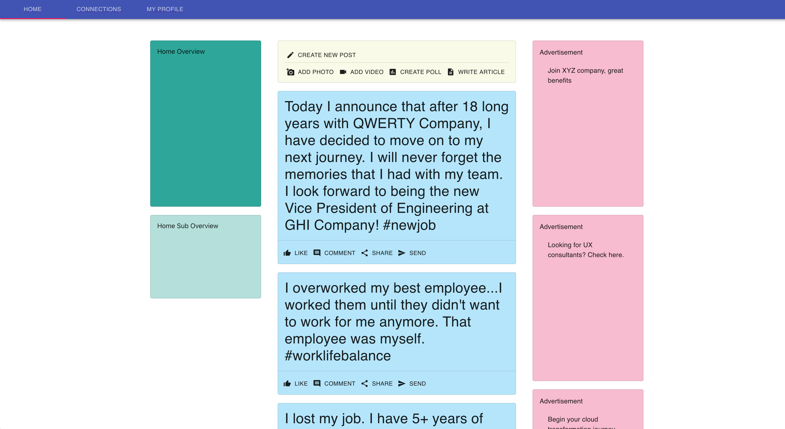
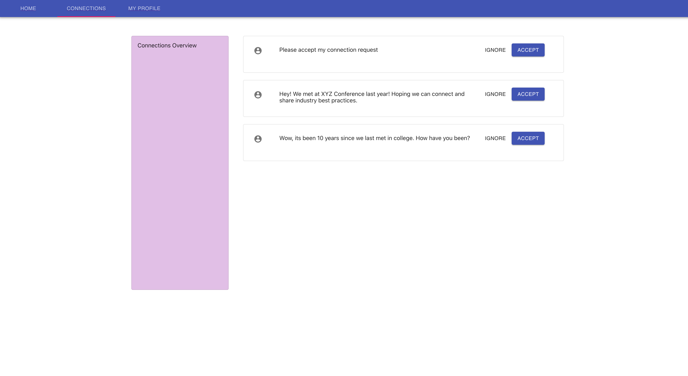
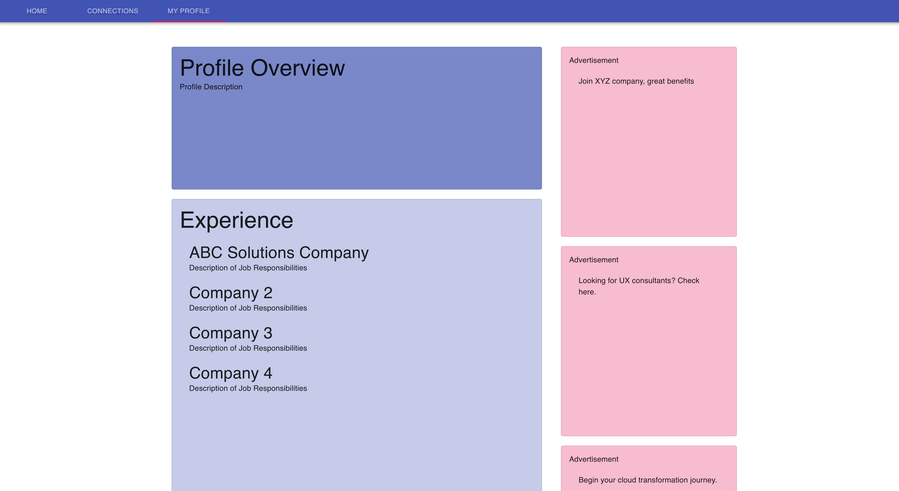

# Unit 4-D Lecture

In this lecture we will cover:
* Material UI
* React Router
* Combining React and Node.js

It is recommended to follow along by making a project directory for this lecture and running the code samples:

```
mkdir lecture4D
cd lecture4D
```

## Material UI

In the previous lectures we learned about creating our own React components. However, there exist a bunch of useful React components already created by third party libraries. We can use these third party React components, as is, or combine them with our own components to make larger React components.

Material UI is a React component created using the Material UI design principles that were created Google.

You can check out the official Material UI documentation here:
https://material-ui.com/getting-started/installation/

Here are some examples of Material UI React components we can use:
* Button - https://material-ui.com/components/buttons/
* Card - https://material-ui.com/components/cards/
* AppBar - https://material-ui.com/components/app-bar/
* Progress - https://material-ui.com/components/progress/
* Floating Action Button - https://material-ui.com/components/floating-action-button/
* Data Grid - https://material-ui.com/components/data-grid/

Material UI also comes with an Icon library:
https://material-ui.com/components/material-icons/

To add the Material UI component library as a dependency to your React project, run:
```
npm install @material-ui/core
```

To add the Material UI icon library as a dependency to your React project, run :
```
npm install @material-ui/icons
```

## Layout Components

Material UI comes with several components that help with the layout and styling of your web page.

### Box

The Box component is essentially just a `div` component, except you can pass in any CSS style attributes as one off attributes instead of using classNames or style objects.

This is useful if you just want to add some margin and padding, but don't want to do the overhead of creating a new CSS rule or a style object.

Official documentation:
https://material-ui.com/components/box/

```jsx
//App.js
import React from 'react'
import {Box} from '@material-ui/core';

function App(){
    return(
        <Box border="1px solid black" margin={"20px"} padding={"20px"}>
          Contents
        </Box>
    )
}

export default App
```

Another useful usecase of the Box component is to make an outer Box a flexbox so that its children can be arranged in a grid like format.

Flexbox cheatsheet:
https://css-tricks.com/snippets/css/a-guide-to-flexbox/

```jsx
//App.js
import React from 'react'
import {Box} from '@material-ui/core';

function App(){
    return(
        <Box display="flex" flexWrap="wrap" border="1px solid black" margin={"20px"} padding={"20px"}>
          {
            new Array(100).fill().map( (x,i) => <Box border="1px solid black" margin={"20px"} padding={"20px"}>{i}</Box>)
          }
        </Box>
    )
}

export default App
```


### Container

The Container component is great for centering all of your UI in the center of the page. Centering your UI makes it easier for your webpage to be viewed on larger monitors.

Offical documentation:
https://material-ui.com/components/container/

To use the Container component:


```jsx
//App.js
import React from 'react'
import {Box,Container} from '@material-ui/core';

function App(){
    return(
        <Container>
          <Box display="flex" flexWrap="wrap" border="1px solid black" margin={"20px"} padding={"20px"}>
          Centered Content
          </Box>
        </Container>
        
    )
}

export default App
```

Here's how the Container would look wrapped around our flexbox example from earlier:

```jsx
//App.js
import React from 'react'
import {Box,Container} from '@material-ui/core';

function App(){
    return(
        <Container>
          <Box display="flex" flexWrap="wrap" border="1px solid black" margin={"20px"} padding={"20px"}>
          {
            new Array(100).fill().map( (x,i) => <Box border="1px solid black" margin={"20px"} padding={"20px"}>{i}</Box>)
          }
          </Box>
        </Container>
        
    )
}

export default App
```

### makeStyles


makeStyles() is a useful method from the Material UI library that lets use define how we want to style or components.

Official documentation:


Here's the basic way to use makeStyles():
```jsx
import React from 'react'
import {Button} from '@material-ui/core';
import { makeStyles } from '@material-ui/core/styles';

const useStyles = makeStyles((theme) => ({ //useMakeStyles() to create CSS rules
  root: {
    backgroundColor:"#FDDA8C",
    height:"1000px"
    
  },
  bigButton: {
    backgroundColor:"teal",
    fontSize:"32px",
    margin:"20px",
    padding:"20px",
    height:"80px",
    width:"200px"
  },
  smallButton:{
    backgroundColor:"orange",
    fontSize:"16px",
    margin:"20px",
    padding:"20px",
    height:"28px",
    width:"60px"
  }

}));

function App(){
  const classes = useStyles(); //apply CSS rules and store them in classes

    return(
        <div className={classes.root}> 
            <Button className = {classes.bigButton} variant="contained">Button</Button>
            <Button className = {classes.smallButton} variant="contained">Button</Button>
            <Button className = {classes.bigButton} variant="contained">Button</Button>
            <Button className = {classes.smallButton} variant="contained">Button</Button>

        </div>  
    )
}

export default App

```
Here are the general steps to use makeStyles():
1. Import makeStyles from the material UI library
2. Pass in a style object into makeStyles() to create a useStyles() method
    1. you can create a separate style for each top level property
3. Use useStyles() to create a `classes` object somewhere near the top of your React component 
4. Now you can apply classNames just by referencing objects off of the `classes` object

Example for #4:
```jsx
<div className={classes.root}> 
```

Whats the difference between this and using a style object? 
1. You can define multiple styles with one obejct and have them as attributes of the main `classes` object
2. You can use more advanced CSS features like `:hover` and `& > *` (applies css rule to all children) that aren't available with style objects


### Grid

Material UI also comes with a Grid component that easily allows you to arrange your components in rows and columns.

Official documentation:
https://material-ui.com/components/grid/

Here's some basic usage of the Grid component:

```jsx
//App.js
import React from 'react'
import {Box,Container,Grid} from '@material-ui/core';

function App(){
    return(
        <Grid container>
          <Grid item xs={4}>
            <Box height = "200px" border="1px solid black">size 4/12</Box>
          </Grid>
          <Grid item xs={4}>
            <Box height = "200px" border="1px solid black">size 4/12</Box>
          </Grid>
          <Grid item xs={4}>
            <Box height = "200px" border="1px solid black">size 4/12</Box>
          </Grid>

          <Grid item xs={6}>
            <Box height = "200px" border="1px solid black">size 6/12</Box>
          </Grid>
          <Grid item xs={6}>
            <Box height = "200px" border="1px solid black">size 6/12</Box>
          </Grid>

          <Grid item xs={8}>
            <Box height = "200px" border="1px solid black">size 8/12</Box>
          </Grid>
          <Grid item xs={3}>
            <Box height = "200px" border="1px solid black">size 3/12</Box>
          </Grid>
          <Grid item xs={1}>
            <Box height = "200px" border="1px solid black">size 1/12</Box>
          </Grid>
        </Grid>     
    )
}

export default App
```

If you go to localhost:3000, youll see three rows of boxes, with each row having varying widths of boxes.

To create a Grid, first wrap everything in a Grid component and add the `container` attribute to specify that this is a Grid container.

```jsx
<Grid container>

</Grid>
```

Then, for each grid section you want to add, add a Grid component with an `item` attribute.

```jsx
<Grid container>
    <Grid item>

    </Grid>
    <Grid item>
    
    </Grid>
</Grid>
```
To specify how much width the Grid item will take, assign the `xs` attribute with a number between 1 and 12. The Grid component uses a 12 division grid system, so a number of 6 would take up half the screen width, while a value of 12 would take up the whole width.

If a row goes over 12 grid divisions, the next grid section will wrap into the next row.

The `xs` is the default breakpoint attribute for any screen size. If you want to specify different Grid breakpoint values for different screen sizes you can use the following attributes:

* xs (extra-small): 0px or larger
* sm (small): 600px or larger
* md (medium): 960px or larger
* lg (large): 1280px or larger
* xl (extra-large): 1920px or larger

You can apply multiple of these breakpoint attributes at the at the same time to tell the Grid section to react differently on different screen sizes:

```jsx
//App.js
import React from 'react'
import {Box,Grid} from '@material-ui/core';

function App(){
    return(
        <Grid container>
          <Grid item xs={4} md={6}>
            <Box height = "200px" border="1px solid black">xs = 4/12, md = 6/12</Box>
          </Grid>
          <Grid item xs={4} md={6}>
            <Box height = "200px" border="1px solid black">xs = 4/12, md = 6/12</Box>
          </Grid>
          <Grid item xs={4} md={12}>
            <Box height = "200px" border="1px solid black">xs = 4/12, md = 12/12</Box>
          </Grid>
        </Grid>    
    )
}

export default App
```

Try, stretching and shrinking the browser width to see how the Grid sections rearrange based on their breakpoint attributes.

**Additional Context:** The Grid container will use the amount of space that it inherits, so if you wrap it with a `<Container>` it will divide up the truncated space that it has into twelfths. If you put a Grid container within another Grid item section, it will divide that Grid items section width into twelfths as well.

## Knowledge Check 1

```jsx
    <Grid container>
          <Grid item xs={12}>
            <Box height = "200px" border="1px solid black">.</Box>
          </Grid>
          <Grid item xs={9}>
            <Box height = "200px" border="1px solid black">.</Box>
          </Grid>
          <Grid item xs={5}>
            <Box height = "200px" border="1px solid black">.</Box>
          </Grid>
          <Grid item xs={4}>
            <Grid container>
                <Grid item xs={9}>
                    <Box height = "200px" border="1px solid black">.</Box>
                <Grid>
            </Grid>
          </Grid>
        </Grid>  
```

How many rows will be in the above grid?

```
A. 1
B. 2
C. 3
D. 4
```


## Other Useful Components

### Buttons

There's a great Button component that you can use from Material UI.

Official documentation:
https://material-ui.com/components/buttons/

Here's some basic usage of Button:

```jsx
//App.js
import React from 'react'
import {Button} from '@material-ui/core';
import { makeStyles } from '@material-ui/core/styles';

const useStyles = makeStyles((theme) => ({
  root: {
    '& > * ': { //& > * means apply css to all children
      margin: theme.spacing(1),
    },
  },
}));

function App(){
  const classes = useStyles();

    return(
        <div className={classes.root}>
            <Button variant="default">Default Variant</Button>
            <Button variant="outlined">Outlined Variant</Button>
            <Button variant="contained">Contained Variant</Button>

            <Button variant="contained" color="primary">
                Primary
            </Button>
            <Button variant="contained" color="secondary">
                Secondary
            </Button>
            <Button variant="contained" disabled>
                Disabled
            </Button>
            <Button variant="contained" color="primary" href="#contained-buttons">
                Link
            </Button>
        </div>  
    )
}

export default App
```
With Button, you can have three variants:
1. default - the button won't have any border or filling
2. contained - the button will be filled
3. outlined - the button will have an outlined border, but it won't be filled

You can also have three colors:
1. default - grey
2. primary - dark purple
3. secondary - magenta

You can change the default, primary and secondary colors by modifying your Material UI Theme:
https://material-ui.com/customization/theming/

### Progress

The Progress component is useful to conditionally render when your React app is still loading. This is especially useful when you are asynchronously fetching data and still waiting for it to load.

Official Documentation
https://material-ui.com/components/progress/

Here's an example of display a progress while your app is waiting for data to fetch:

```jsx
//App.js

import React, {useState, useEffect} from 'react'
import {LinearProgress} from '@material-ui/core/';


function App(){
    const [data,setData] = useState([])
    const [loading,setLoading] = useState(true)
    
    useEffect(() => {
        async function fetchData(){
            let responseStream = await fetch('https://swapi.dev/api/films/')
            let json = await responseStream.json()
            console.log(json.results)
            setData(json.results)
            setLoading(false)
            
        }
        fetchData()
    },[])
    if(loading){
        return <div><LinearProgress/></div>
    }
    return (
        <div>
            {data.map(x => {
              return (
                <div>
                  <h1>Episode {x.episode_id} : {x.title}</h1>
                  <p>{x.opening_crawl}</p>
                </div>
              )
              })
            }
        </div>
    )
}

export default App
```

Instead of a linear progress bar, You can use a circular variation with `<CircularProgress/>`.

You also specify how filled you want the progress bar to be by setting the `variant` attribtute to `determinate` and then passing in a value(0-100):

```jsx
<LinearProgress variant="determinate" value={progress} />
```


### AppBar and Tabs

The AppBar component is great if you want to have a top navigation bar for your React app. 

The Tabs component is also great if you want to be able to toggle through different tags. It works nicely with React state as well.


Official documentation:
* https://material-ui.com/components/app-bar/
* https://material-ui.com/components/tabs/


You can combine AppBar and Tabs to make a really nice user navigation experience:


```jsx
import React,{useState} from 'react'
import {Tabs,Tab,AppBar} from '@material-ui/core';


function App(){
  const [activeTab,setActiveTab] = useState(0)

    return(
        <div>
          <AppBar>
            <Tabs value={activeTab}>
              <Tab onClick={()=> setActiveTab(0)} label="Tab 1" value = {0}/>
              <Tab onClick={()=> setActiveTab(1)} label="Tab 2" value = {1}/>
              <Tab onClick={()=> setActiveTab(2)} label="Tab 3" value = {2}/>
            </Tabs>
          </AppBar>
        </div>
    )
}

export default App
```
In this example, we created a state variable, `activeTab` to hold the active tab. We then passed a click handler to change the `activeTab` value with `setActiveTab` whenever we clicked on a specific tab to make that tab become active.

### Icons

Material UI has a great library of icons:
https://material-ui.com/components/material-icons/


To use Icons simply import them and use them as components:

```jsx
//App.js
import React from 'react'
import {Button, IconButton} from '@material-ui/core';
import AddIcon from '@material-ui/icons/Add';
import DeleteIcon from '@material-ui/icons/Delete';


function App(){

    return(
        <div>
          <Button variant="contained" color="primary" startIcon={<AddIcon/>}>Add Item</Button>
 
          <Button variant="contained" color="secondary" endIcon={<DeleteIcon/>}>Delete Item</Button>

          <IconButton>
            <AddIcon/>
          </IconButton>
          <IconButton>
            <DeleteIcon/>
          </IconButton>
        </div>
    )
}

export default App
```

Its often difficult to use Icons by themselves. It is recommended to wrap them with an `<IconButton>` component or use them as the startIcon or endIcon attribute of a `<Button>` component.

## Knowledge Check 2

How many button style variants does the Material UI Button have?
```
A. 1
B. 2
C. 3
D. 4
```


## React Router

React does not come with a routing solution, meaning that your React app will be stuck as a single page app unless you add in a routing solution.

React Router is a popular routing library for React. It allows you to render different React components based on the URL. This means you could go to website.com/home, website.com/about, and website.com/users and see different React components rendered to the screen.

Official documentation:
https://reactrouter.com/web/guides/quick-start

To add React Router as a dependency to your React project:

```
npm install react-router-dom
```


Here's a quick example that shows off the most commonly used features of React Router:

```jsx
//App.js
import React from "react";
import {
  BrowserRouter as Router,
  Switch,
  Route,
  Link
} from "react-router-dom";

export default function App() {
  return (
    <Router>
      <div>
        <nav>
          <ul>
            <li>
              <Link to="/">Home</Link>
            </li>
            <li>
              <Link to="/about">About</Link>
            </li>
            <li>
              <Link to="/users">Users</Link>
            </li>
          </ul>
        </nav>

        {/* A <Switch> looks through its children <Route>s and
            renders the first one that matches the current URL. */}
        <Switch>
          <Route path="/about">
            <About />
          </Route>
          <Route path="/users">
            <Users />
          </Route>
          <Route path="/">
            <Home />
          </Route>
        </Switch>
      </div>
    </Router>
  );
}

function Home() {
  return <h2>Home</h2>;
}

function About() {
  return <h2>About</h2>;
}

function Users() {
  return <h2>Users</h2>;
}

```

What is going on in the above example?
1. We imported BrowserRouter(aliased as Router), Switch, Route, and Link from the React Router library
2. We wrapped our return statement with the Router component, this is necessary if you want to use any features from React Router 
3. We added a couple of Link components at the top. Clicking on a Link component will change the URL to whatever is passed to the `to` property.
4. We added some Switch and Route components at the bottom.
    1. The Switch component will choose to render the first Route that "matches" the URL
    2. Route components render a specified component when they "match" the URL
5. We defined a few React components that will be rendered by the Route components

The end result is that when we click the Links, the URL changes. And based on the URL change, different React Components get rendered.

**Warning:** If you are hosting a React app using React Router using Express, make sure that your endpoints don't collide with your React Router Routes 

### Routers and Routes

#### BrowserRouter

The BrowserRouter component is a wrapper component that allows all of the other React Router components to work. The BrowserRouter component can only have one child element. There are other types of Router components but the BrowserRouter component is the main router we will be using in this course. We can import the BrowserRouter component with:

```jsx
//App.js
import React from 'react'
import { BrowserRouter as Router} from "react-router-dom"

const App = () => (
  <Router>
    <div> 
    </div>
  </Router>
)
export default App
```

We often alias BrowserRouter to be Router, since its shorter.
### Route

The Route component is probably the most important component out of the React Router library. It is used to render a specific component when a specified URL path occurs. 

We can reference the Route component using the `<Route>` tag. Here's an example of how to render a component at a spefici URL route with the Route component:

```jsx
//App.js
import React from 'react'
import { BrowserRouter as Router, Route} from "react-router-dom"

const App = () => (
  <Router>
    <div> 
        <Route path="/about" render={(props) => <About {...props} value={"hello"}/>}/>
    </div>
  </Router>
)

function About(props){
    return <div>{props.value}</div>
}
export default App
```
This example will render the About component when we visit localhost:3000/about.

To render a component with Route, it is recommended to use the `render` attribute, which takes an inline function describing what to render. 

```jsx
    <Route path="/about" render={(props) => <About {...props} value={"hello"}/>}/>
```

**Note:** There are other ways to render a component in React Router, but using `render` is recommended.


You can still pass props to your component as usual, but there is also some special Route properties that are added by React Router as props to your component. We will cover these special route props later. 

**Note:** To get the special route props, you have to pass them down with ...props

### Path
The path property is used to define the URL path that the component will render on. A Route component with no path property will always trigger a match and render. Matches are determined by doing a regex comparison between the URL path and the path property pattern. However, since it uses a regex match, it is possible for a match to occur even if the URL and the path pattern don't match exactly.

For example if the URL path is `localhost:3000/about/123` then both of the routes shown below will still render because `/about/123` contains both `/` and `/about:

```jsx
<Route path="/" render={(props) => <div>Home</div>}/> //A URL path of "/about/123" matches because "/about/123" contains "/" 
<Route path="/about" render={(props) => <div>About</div>}/> //A URL path of "/about/123" matches because "/about/123" contains "/about
```        

#### Exact
To account for this, be sure to add the exact property if you only want a route to render on an exact match. Trailing slashes on the URL don't factor in to the matching.

```jsx
<Route exact path="/" render={(props) => <div>Home</div>}/> // "only a URL path of "/" will match
```

#### Strict

Use the strict property when you want trailing slashes to factor in to the matching.

```jsx
<Route strict path="/about" render={(props) => <div>About</div>}/> // A URL path of "/about" matches but "/about/" doesn't match
```


#### Route properties

Components that are rendered via Route components will have special route props passed down to them.

Here are the route properties that are passed down as props:

* match
* location
* history

You can access them through props, just like any other React property:

```jsx
//App.js
import React from 'react'
import { BrowserRouter as Router, Route} from "react-router-dom"

const App = () => (
  <Router>
    <div> 
        <Route path="/about" render={(props) => <About {...props} value={"hello"}/>}/>
    </div>
  </Router>
)

const About = (props) => {
  console.log(props.match)
  // Object {path: "/about", url: "/about", isExact: true, params: Object}
  console.log(props.location)
  // Object {pathname: "/about", search: "", hash: "", state: undefined}
  console.log(props.history)
  // Object {length: 1, action: "POP", location: Object}
  return (
    <div>
      {props.value}
    </div>
)}
export default App
```
If you go to localhost:3000/about and check the logs, you should see some data printed out related to matched route.

##### match
The match props is null when there is no match, but contains useful information when a match occurs. The match object contains the following information about a matched path that caused a component to be rendered:

* params (object) - contains key/value pairs of the dynamic segments that are used in the path pattern (e.g. {userId = 123} when path = “/user/:userId” and the URL is "/user/123")
* isExact (boolean) - true if the URL is an exact match with the path property
* path (string) - the path property of the route component. Useful for building nested routes
* url (string) - the matched portion of the URL. Useful for building nested Links

#### location
The location props contains the following information about the path that was rendered:

* pathname (string) - the full path of the URL
* search (string) - the URL query string
* hash (string) - the URL hash fragment
* state (object) - the current state, if a state was provided to history.push(path, [state]), otherwise undefined

##### history
The history props contains the following information about the path that was rendered:

* length (number) - The number of entries in the history stack
* action (string) - (PUSH, POP, or REPLACE)
* location (object) - see location
It also has the following methods:
* push(path, [state]) - (function) Pushes a new entry onto the history
* replace(path, [state]) - (function) Replaces the current entry on the history stack
* go(n) - (function) Moves the pointer in the history stack by n entries
* goBack() - (function) Equivalent to go(-1)
* goForward() - (function) Equivalent to go(1)
* block(prompt) - (function) Prevents navigation (see the history docs)

The push() method is particular useful because you can programatically call `props.history.push("/someRoute")` to change the URL during a click event or during some other logic.

## Knowledge Check 3

What Route property has information about the URL path that the Route was rendered on?

```
A. match
B. location
C. history
D. path
```

#### URL Parameters
URL parameters are segments of your URL path that can vary and be parsed from the URL. To define a segment of your path to be a URL param, add a colon in front of the segment name:

```js
    <Route path="/userId/:id" render={(props) => <div>Home</div>}/>
```

The “:id” portion of the URL path can now vary and the route will still match. For example "/userId/123" and “/userId/abc”, will both cause a match.

You can access the URL param value by using the match.params object that is passed down to the rendered component:


```jsx
//App.js
import React from 'react'
import { BrowserRouter as Router, Route} from "react-router-dom"

const User = ({match}) => {
 return (
   <div>
     UserId: {match.params.id} 
   </div>
)}

const App = () => (
 <div>
   <Router>
     <Route path="/userId/:id" render = {(props) => <User {...props}/>}/>
   </Router>
 </div>
);

export default App
```
Now if we go to localhost:3000/userId/123, we will see UserId: 123 displayed on the page.

### Switch

We saw earlier that every Route has the potential to render a component if the URL matches it.

The Switch component will exclusively render the first Route component that matches, even if others also have matches.

```jsx
//App.js
import React from 'react'
import { BrowserRouter as Router, Route, Switch} from "react-router-dom"

const App = () => (
  <Router>
    <Switch> 
        <Route path="/about" render={(props) => <About {...props} value={"hello"}/>}/>
        <Route path="/about" render={(props) => <About {...props} value={"no show"}/>}/>
        <Route render={(props) => <About {...props} value={"default"}/>}/>

    </Switch>
  </Router>
)

function About(props){
    return <div>{props.value}</div>
}
export default App
```

If we go to localhost:3000/about, we see that only one of the Routes will render.

**Best Practice:** It is a best practice to have a default Route at the bottom of a Switch that will always render. You can make a route always render by omitting the path attribute. 

If we go to localhost:3000/ we can see the default Route render because there were no other Route matches.

### Links
The Link component is used to provide a clickable link that will change the URL of the page.

```jsx

<Link to="/somewhere">Somewhere</Link>

```

The Link component has a `to` property that specifies what the URL will change to when the Link component is clicked. Any string value can be passed to the to property including string values with queries and hashtags.

```jsx
import React from 'react'
import { BrowserRouter as Router, Route, Switch, Link} from "react-router-dom"

const App = () => (
  <Router>
      <ul>
        <Link to="/a/b/c/d"><li>Path</li></Link>
        <Link to="/#clothes"><li>Hashtag</li></Link>
        <Link to="/items?id=123"><li>QueryString</li></Link>
      </ul>

  </Router>
)


export default App

```

Links often have to be combined with some other HTML elements in order to look decent. In the above example, we wrapped the Links with `<ul>` and `<li>` elements.

Links can work great with Material UI tabs and buttons as well:


```jsx
//App.js
import React,{useState} from 'react'
import {Tabs,Tab,AppBar} from '@material-ui/core';
import { BrowserRouter as Router, Route, Switch, Link} from "react-router-dom"


function App(){
  const [activeTab,setActiveTab] = useState(0)

    return(
      <Router >
        <AppBar color="default">
            <Tabs value={activeTab}>
            <Link to="/home">
              <Tab onClick={()=> setActiveTab(0)} label="Tab 1" value = {0}/>
            </Link>
            <Link to="/items">
              <Tab onClick={()=> setActiveTab(1)} label="Tab 2" value = {1}/>
            </Link>
            <Link to="/cart">
              <Tab onClick={()=> setActiveTab(2)} label="Tab 3" value = {2}/>
            </Link>

            </Tabs>
          </AppBar>
        </Router>
    )
}

export default App
```

## Knowledge Check 4

How many Routes can be rendered from a Switch statement?
```
A. One As many Routes that match the URL
B. As many Routes that match the URL
C. Two
D. You set a property in the switch statement to determine how many
```

## Redirects

You can use a Redirect to redirect a user to a different path. One use case is to redirect a user if they aren't a valid user:


```jsx
//App.js
import React from 'react'
import { BrowserRouter as Router, Route, Switch, Redirect} from "react-router-dom"

var validUser = false

const ValidateUser = () => {
    if(validUser){
        return <div>Welcome User</div>
    }
    else{
        return <Redirect to="/error"/>
    }
}

const Login = () => {
    validUser = true
    return <div>Logged In</div> 
}

const Error = () => {
    return <div>Please Log In</div> 
}

const App = () => (
  <Router>
    <Switch> 
        <Route exact path="/user" render={()=> <ValidateUser/>}/>
        <Route exact path="/error" render={() => <Error/>}/>
        <Route exact path="/login" render={() => <Login/>}/>
    </Switch>
  </Router>
)


export default App
```

If we go to localhost:3000/user, we can see that we were redirected to localhost:3000/error.

## Combining React with Node.js

### Serving React and Node.js separately

One way to combine a React frontend and a Node.js backend server is to host them separately. You can then set the CORS permissions so that the React frontend can access the server API's. 

This approach allows you to separate your frontend and backend into separate codebases. It also allows you to scale both of their servers independently of eachother. 

You can also use different hosting solutions for each of them. For example, the React frontend can be put on a static hosting solution like Netlify or AWS S3, while the Node.js server can be hosted on a PaaS hosting solution like Heroku or some IaaS hosting solution like AWS EC2. 

### Combining React and Node.js into one Express application

Another way to combine React and Node.js is to run create-react-app within an Express application folder. This will create a React project directory with all of the create-react-app build tools. Then, when you run your server start script, you can add a step to create a production build for your React app. You can specify your entire build folder to be statically served by Express. Then you just need to have an express endpoint that points to index.html in the build folder that has all your React components embedded.

This approach allows you to keep your front end and backend code all in one codebase, allowing them to share logic as well as React components if you are doing any server side rendering. You can also host them both on the same container. The main drawback is that all shut off your front end, you are also shutting off your server and vice versa.

Here are the step by step instructions:
1. Create a new project directory and cd into it

```
mkdir node-react
cd node-react
```

2. Start a new node project with npm init

```
npm init
```

3. Add express as a dependency

```
npm install express
```

4. Create an index.js file:

```js
//index.js
const express = require('express')
const path = require('path')
const app = express()
const port = 8080

app.use(express.static(path.join(__dirname, 'build')))

app.get('/api', (req, res) => {
  return res.json({message:"hello world"})
})

app.get('/', (req, res) => {
  res.sendFile(path.join(__dirname, 'build', 'index.html'))
})

app.listen(port, () => {
  console.log(`Server running on port ${port}`)
})
```
At the top, we configure the server to statically serve the React build folder.

We then set an endpoint at `/` that will serve the index.html file from our React build.

5. We create a React project in a client directory by running:

```
npx create-react-app client
```

6. Add a proxy anywhere in the top level of your Package.json:
```js
  ...
  "scripts": {
    "start": "react-scripts start",
    "build": "react-scripts build",
    "test": "react-scripts test",
    "eject": "react-scripts eject"
  },
  "proxy": "http://localhost:8080",
  ...
```
6. We edit the package.json in our root folder (not the React package.json) start script to be:
```js
  "scripts": {
    "start":"npm run build && node .",
    "build":"cd client && npm run build",
    "test": "echo \"Error: no test specified\" && exit 1"
  },
```
7. Now we can build our production build and then run our Node server with:

```npm start```

8. Go to localhost:8080/ to see your React production build served by Express!

9. If we want to fetch any data from our Express API we can use the following in our client:

In `/client/src/App.js`:
```js
//App.js
import React, {useEffect} from 'react';
import logo from './logo.svg';
import './App.css';

function App() {
  const getData = ()=> {
    fetch("/api")
    .then( res.json())
    .then( res => {
      console.log(res)
    })
  }
  useEffect(() => {
    getData()
  },[])
  return (
    <div>
      Fetched data in console log
    </div>
  );
}

export default App;

```
**Note:** Whenever we edit our React client, we need to rebuild it.

10. If we want to use this solution with React Router we need to add an `*` at the end of our / path that serves our frontend:

```js
//index.js
const express = require('express')
const path = require('path')
const app = express()
const port = 8080

app.use(express.static(path.join(__dirname, 'build')))

app.get('/api', (req, res) => {
  return res.json({message:"hello world"})
})

app.get('/*', (req, res) => {
  res.sendFile(path.join(__dirname, 'build', 'index.html'))
})

app.listen(port, () => {
  console.log(`Server running on port ${port}`)
})
```

The `/*` is a wild card that makes the endpoint serve on all URL routes. Make sure to put the endpoint at the bottom of your index.js file otherwise it will trigger instead of your API endpoints as well.


# Unit 4-D Lab

## Lab Overview

Your lab assignment will be to create a LinkedIn clone mockup using React Router and components from Material UI. 

The LinkedIn clone will have the following three pages:
* Home - where you can see a newsfeed of LinkedIn posts
* Connections - where you can view your connection requests
* Profile - where you can view your profile

You will be only be building a mockup of the LinkedIn website so you won't need to build any actual functionality besides switching between the pages in the navigation bar.

Here are some screenshots of the solution:

Home:

Connections:

Profile:


You will use Material UI and React Router to build a multi-paged React application.

The following material UI components will make your development process easier:
* Box - like a div, but you can add styles as attributes
* Button - fancier buttons, holds icons too
* Container - make everything centered horizontally around the middle of the page
* Grid - for defining rows and columns in a grid layout
* IconButton - for holding an icon by itself
* Card - for cards
  * CardContent - for the body of a card
  * CardActions - for card actions at the bottom
* Typography - for text styling
* Divider - to make a dividing line
* TextField - for input forms

Also, try to use some Icons from the Material UI Icon library:
https://material-ui.com/components/material-icons/


As a challenge, try to only use components from React Router or Material UI and not any standard HTML elements (div,p,h1,etc.)


You can get more details on those components by viewing the documentation:
https://material-ui.com/components/box/


## Lab Starter Code

You will be given a basic Navigation Bar that changes the URL using React Router links. Nothing will happen when you click the links though, so you will have to add Route components to render the the pages accodingly.

You should create separate component files for the Home page, Connections page, and Profile page.
You should also create separate components for each differently colored block shown in the solution example screenshot and use those to build your main page components.

Some of the examples in the screenshot are more fleshed out than others(e.g. the posts). To start off, just try to get the layout correct for each page using empty cards before adding more details to any individual components.

## Lab Solution
You can view the lab solution here:
https://github.com/flatiron-school/node-express-intro/tree/main/Labs/Lab-4C-Solution

# Knowledge Check Answers


## Knowledge Check 1

```jsx
    <Grid container>
          <Grid item xs={12}>
            <Box height = "200px" border="1px solid black">.</Box>
          </Grid>
          <Grid item xs={9}>
            <Box height = "200px" border="1px solid black">.</Box>
          </Grid>
          <Grid item xs={5}>
            <Box height = "200px" border="1px solid black">.</Box>
          </Grid>
          <Grid item xs={4}>
            <Grid container>
                <Grid item xs={9}>
                    <Box height = "200px" border="1px solid black">.</Box>
                <Grid>
            </Grid>
          </Grid>
        </Grid>  
```

How many rows will be in the above grid?

```
A. 1
B. 2
C. 3
D. 4
```

Answer is C.


## Knowledge Check 2

How many button style variants does the Material UI Button have?
```
A. 1
B. 2
C. 3
D. 4
```

Answer is C.


## Knowledge Check 3

What Route property has information about the URL path that the Route was rendered on?

```
A. match
B. location
C. history
D. path
```

Answer is A.

## Knowledge Check 4

How many Routes can be rendered from a Switch statement?
```
A. One As many Routes that match the URL
B. As many Routes that match the URL
C. Two
D. You set a property in the switch statement to determine how many
```

Answer is A.


